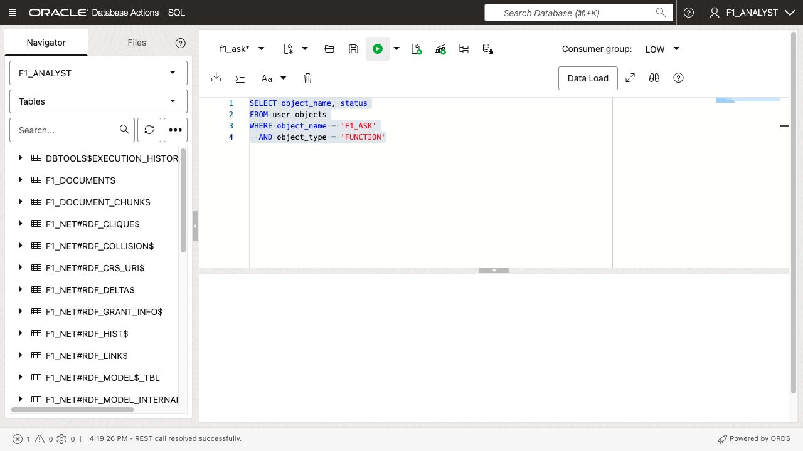
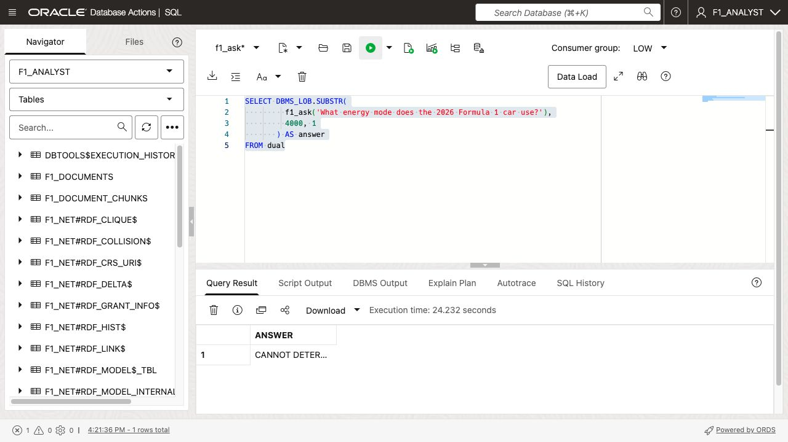
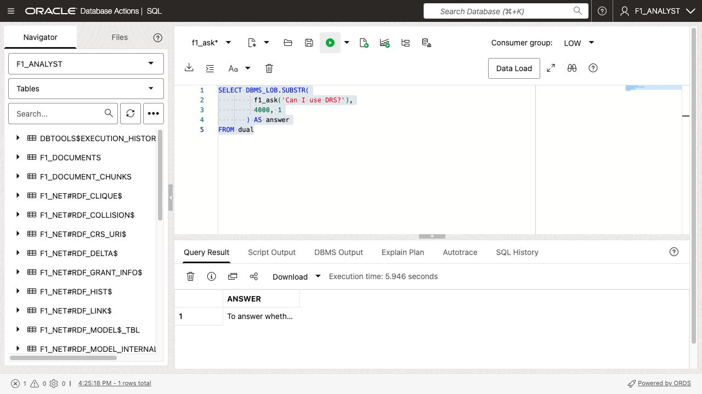
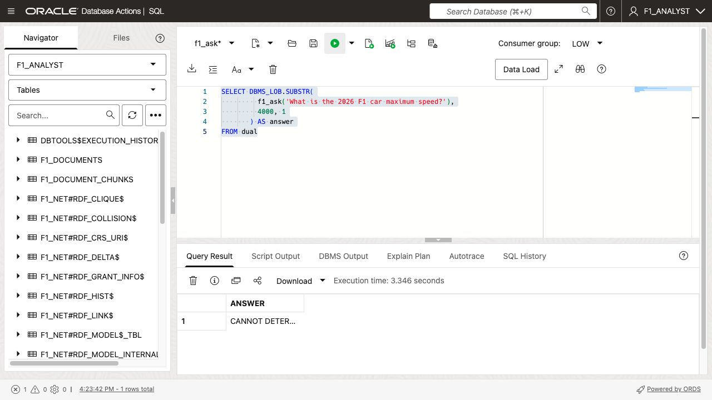
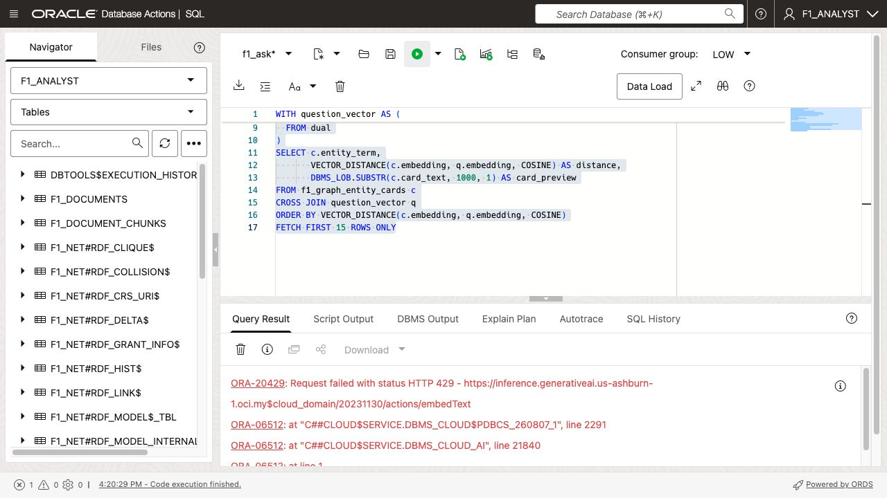

# Ask Ontology-Grounded Questions

## Introduction

In this lab, you will create `f1_ask`, a function that uses vector search to select relevant graph entities, expands those entities into RDF triples, and asks a chat model to answer using the ontology and the selected RDF facts only.

The ontology is schema context: it explains classes, aliases, inverse properties, and permitted relationships. The retrieved RDF triples are the evidence used to answer each question. Vector search improves focus and scale; it does not replace the RDF graph.

Estimated Time: 10 minutes

### Objectives

- Create an ontology- and graph-grounded question-answering function.
- Test answers and inspect the selected RDF facts.
- Explain how vectors, RDF facts, and the ontology work together.

## Task 1: Create the question-answering function

1. Create the function. Replace `F1_EMBED_PROFILE`, `GENAI_PROFILE`, the graph model, and semantic network names if they differ in your environment.

    ```sql
    CREATE OR REPLACE FUNCTION f1_ask (
  p_question IN VARCHAR2
) RETURN CLOB
AUTHID DEFINER
AS
  l_graph_facts CLOB;
BEGIN
  SELECT TO_CLOB(
           LISTAGG(
             f_s$rdfterm || ' ' ||
             f_p$rdfterm || ' ' ||
             f_o$rdfterm,
             CHR(10)
           ) WITHIN GROUP (ORDER BY f_p$rdfterm)
         )
    INTO l_graph_facts
    FROM TABLE(
      SEM_MATCH(
        'SELECT ?f_s ?f_p ?f_o
           WHERE { ?f_s ?f_p ?f_o }',
        SEM_MODELS('F1_2026_GRAPH'),
        NULL,
        NULL,
        NULL,
        NULL,
        'PLUS_RDFT=VC',
        NULL,
        NULL,
        'F1_ANALYST_V2',
        'RDF_NETWORK'
      )
    );

  RETURN DBMS_CLOUD_AI.GENERATE(
    prompt => TO_CLOB(
      'Answer the user naturally, using only these RDF graph facts. ' ||
      'Do not use outside knowledge. State NOT COMPLIANT if any stated ' ||
      'vehicle characteristic violates a graph requirement. If facts are ' ||
      'missing, say CANNOT DETERMINE.' || CHR(10) || CHR(10) ||
      'RDF graph facts:' || CHR(10)
    ) || l_graph_facts || TO_CLOB(
      CHR(10) || CHR(10) ||
      'User question: ' || p_question
    ),
    profile_name => 'GENAI_PROFILE',
    action       => 'chat'
  );
END;
/

    ```

  

## Task 2: Test grounded answers

1. Ask a question that the graph is expected to answer.

    ```sql
    SELECT DBMS_LOB.SUBSTR(
             f1_ask('What energy mode does the 2026 Formula 1 car use?'),
             4000, 1
           ) AS answer
    FROM dual;
    ```

    

2. Test a term or feature in the source graph.

    ```sql
    SELECT DBMS_LOB.SUBSTR(
             f1_ask('Can I use DRS?'),
             4000, 1
           ) AS answer
    FROM dual;
    ```

    

3. Test the missing-information behavior.

    ```sql
    SELECT DBMS_LOB.SUBSTR(
             f1_ask('What is the 2026 F1 car maximum speed?'),
             4000, 1
           ) AS answer
    FROM dual;
    ```
SELECT comp_name, status, version
FROM dba_registry
WHERE UPPER(comp_name) LIKE '%JAVA%';

SELECT dbms_java.get_jdk_version
FROM dual;

SELECT owner, object_type, object_name, status
FROM all_objects
WHERE object_type LIKE 'JAVA%'
  AND UPPER(object_name) LIKE '%SQLENTRYPOINTS%';


SELECT f1_ask('What aero modes are used in 2026?') FROM dual;

    

## Task 3: Inspect the graph context sent to the model

1. Run this query to see the RDF triples selected for a question before the chat model is called.

    ```sql
    WITH question_vector AS (
      SELECT TO_VECTOR(
               DBMS_CLOUD_AI.GENERATE(
                 prompt       => 'Can I use DRS?',
                 profile_name => 'F1_EMBED_PROFILE',
                 action       => 'embedding'
               )
             ) AS embedding
      FROM dual
    ),
    relevant_entities AS (
      SELECT c.entity_term,
             VECTOR_DISTANCE(c.embedding, q.embedding, COSINE) AS distance
      FROM f1_graph_entity_cards c
      CROSS JOIN question_vector q
      ORDER BY VECTOR_DISTANCE(c.embedding, q.embedding, COSINE)
      FETCH FIRST 15 ROWS ONLY
    )
    SELECT e.entity_term, e.distance,
           r.RDF$STC_SUB, r.RDF$STC_PRED, r.RDF$STC_OBJ
    FROM relevant_entities e
    JOIN f1_rdf_load_stg r
      ON r.RDF$STC_SUB = e.entity_term
      OR r.RDF$STC_OBJ = e.entity_term
    ORDER BY e.distance, r.RDF$STC_PRED;
    ```

    This query makes the retrieval path explainable: question, vector-selected entities, connected RDF facts, and final answer. The function always sends RDF facts and the ontology to the chat model; it never sends source PDF chunks as answer context.

    

<!-- ask a question, add a triple, and then ask a question based on that triple -->

## Learn More

- [Oracle AI Vector Search](https://docs.oracle.com/en/database/oracle/oracle-database/26/vecse/ai-vector-search-users-guide.pdf)
- [Oracle RDF Graph Developer's Guide](https://docs.oracle.com/en/database/oracle/oracle-database/26/rdfrm/graph-developers-guide-rdf-graph.pdf)

## Acknowledgements

- **Author** - Oracle Graph Product Management, Oracle
- **Last Updated** - August 2026
