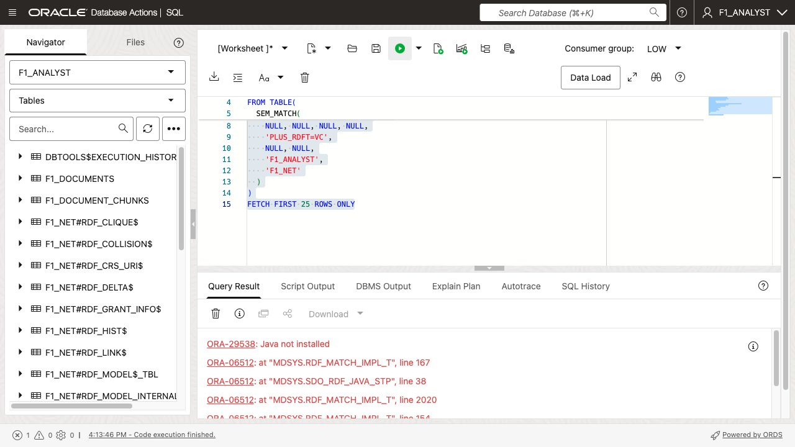
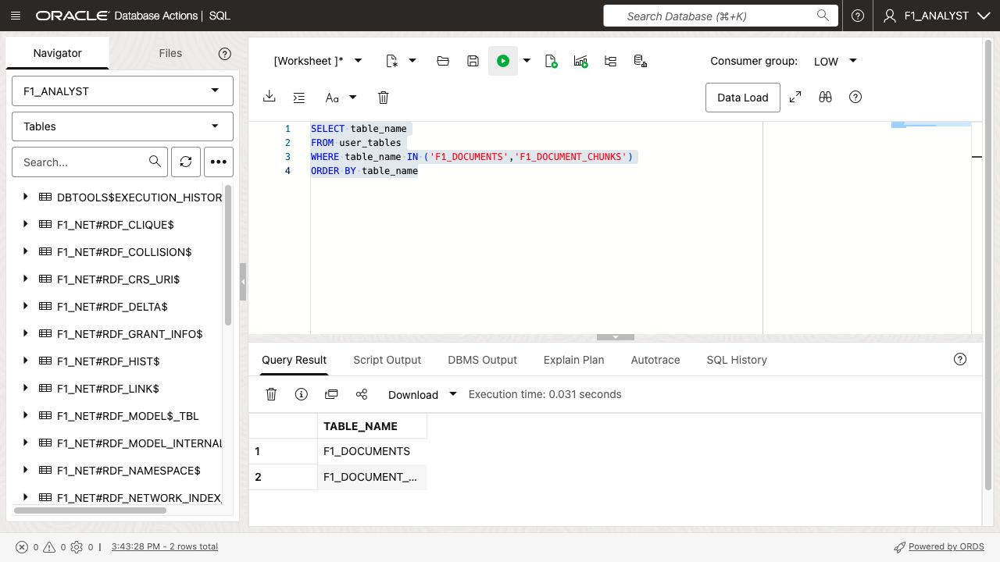
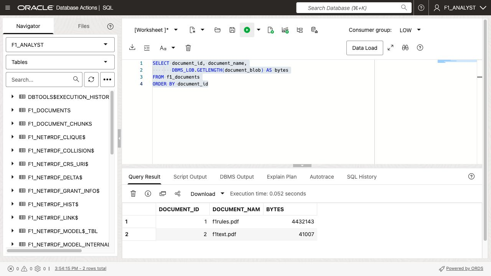
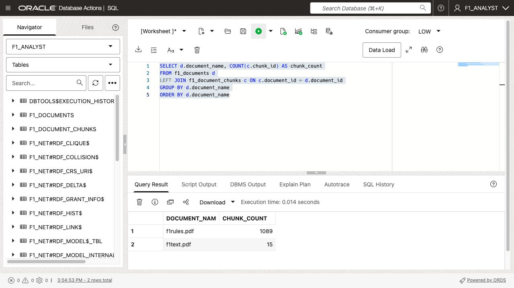

# Ingest and Chunk Formula 1 Documents

## Introduction

In this lab, you will store two F1 PDFs in Oracle AI Database, extract text from them, and split the text into overlapping chunks. Chunking is the bridge between an original document and downstream AI operations: it gives extraction and embedding models focused, bounded input while preserving the source document identity.

Estimated Time: 15 minutes

### Objectives

- Create tables for documents and chunks.
- Load two PDF documents from read-only PAR URLs.
- Verify text extraction.
- Create overlapping chunks for every loaded document.

## Task 1: Enable Oracle JVM for RDF queries

`SEM_MATCH`, used in Lab 3, requires Oracle JVM on Autonomous Database. If
your database already reports `JAVAVM` as `VALID`, skip the enable command and
continue with the verification query.

1. Connect to the database as `ADMIN`. The feature cannot be enabled from the
   `F1_ANALYST` schema.

2. Request Oracle JVM installation.

    ```sql
    BEGIN
      DBMS_CLOUD_ADMIN.ENABLE_FEATURE(
        feature_name => 'JAVAVM'
      );
    END;
    /
    ```

3. Restart the Autonomous Database from the OCI Console. The restart is
   required for the installation to proceed. Enabling Oracle JVM is permanent
   for this database.

4. After the database is available, remain connected as `ADMIN` and verify
   the component status.

    ```sql
    SELECT status, version
    FROM dba_registry
    WHERE comp_id = 'JAVAVM';
    ```

    Continue when the result is `VALID`. If the result is `LOADING`, wait and
    run the query again. If no row is returned, Oracle JVM is not enabled.

5. Verify that the Java runtime is available.

    ```sql
    SELECT dbms_java.get_jdk_version
    FROM dual;
    ```

    Reconnect as `F1_ANALYST` before continuing with the remaining tasks in
    this lab.

    The later `SEM_MATCH` check should work when this prerequisite is active. If
    the learner session returns the error shown below, use the direct graph-table
    fallback documented in Lab 3 and have an administrator recheck Oracle JVM.

    

## Task 2: Create document storage

1. Create a table that stores each PDF once.

    ```sql
    CREATE TABLE f1_documents (
      document_id   NUMBER GENERATED BY DEFAULT AS IDENTITY
                    CONSTRAINT f1_documents_pk PRIMARY KEY,
      document_name VARCHAR2(255) NOT NULL,
      document_blob BLOB NOT NULL,
      loaded_at     TIMESTAMP DEFAULT SYSTIMESTAMP NOT NULL
    );
    ```

2. Create a child table for the extracted text chunks.

    ```sql
    CREATE TABLE f1_document_chunks (
      document_id NUMBER NOT NULL,
      chunk_id    NUMBER NOT NULL,
      chunk_text  CLOB NOT NULL,
      CONSTRAINT f1_document_chunks_pk PRIMARY KEY (document_id, chunk_id),
      CONSTRAINT f1_document_chunks_document_fk
        FOREIGN KEY (document_id) REFERENCES f1_documents (document_id)
    );
    ```

    The composite primary key matters because chunk numbering restarts for each document. A chunk is identified by the pair `(document_id, chunk_id)`.

    

## Task 3: Load the two PDFs

1. Replace the PAR URL placeholders and run the inserts.

    ```sql
    INSERT INTO f1_documents (document_name, document_blob)
    VALUES ('f1text.pdf', DBMS_CLOUD.GET_OBJECT(
      credential_name => NULL,
      object_uri => '<read-only-PAR-URL-for-f1text.pdf>'
    ));

    INSERT INTO f1_documents (document_name, document_blob)
    VALUES ('f1rules.pdf', DBMS_CLOUD.GET_OBJECT(
      credential_name => NULL,
      object_uri => '<read-only-PAR-URL-for-f1rules.pdf>'
    ));

    COMMIT;
    ```

2. Confirm that both documents are present.

    ```sql
    SELECT document_id, document_name,
           DBMS_LOB.GETLENGTH(document_blob) AS bytes
    FROM f1_documents
    ORDER BY document_id;
    ```

    

## Task 4: Extract text and create chunks

1. Preview the first 1,000 characters from every PDF.

    ```sql
    SELECT document_id, document_name,
           DBMS_LOB.SUBSTR(
             DBMS_VECTOR_CHAIN.UTL_TO_TEXT(document_blob),
             1000, 1
           ) AS text_preview
    FROM f1_documents;
    ```

2. Create chunks for each document.

    ```sql
    INSERT INTO f1_document_chunks (document_id, chunk_id, chunk_text)
    SELECT d.document_id,
           JSON_VALUE(c.column_value, '$.chunk_id' RETURNING NUMBER),
           JSON_VALUE(c.column_value, '$.chunk_data' RETURNING CLOB)
    FROM f1_documents d
    CROSS JOIN TABLE(
      DBMS_VECTOR_CHAIN.UTL_TO_CHUNKS(
        DBMS_VECTOR_CHAIN.UTL_TO_TEXT(d.document_blob),
        JSON('{
          "by":"chars",
          "max":"750",
          "overlap":"150",
          "split":"recursively",
          "language":"american",
          "normalize":"all"
        }')
      )
    ) c;

    COMMIT;
    ```

    `TABLE(...)` makes the collection returned by `UTL_TO_CHUNKS` queryable. `CROSS JOIN` means “for each document, return every chunk generated from that document.” It does not combine the documents.

3. Confirm the chunk count by source document.

    ```sql
    SELECT d.document_name, COUNT(*) AS chunk_count
    FROM f1_documents d
    JOIN f1_document_chunks c ON c.document_id = d.document_id
    GROUP BY d.document_name
    ORDER BY d.document_name;
    ```

    

## Acknowledgements

- **Author** - Oracle Graph Product Management, Oracle
- **Last Updated** - August 2026
