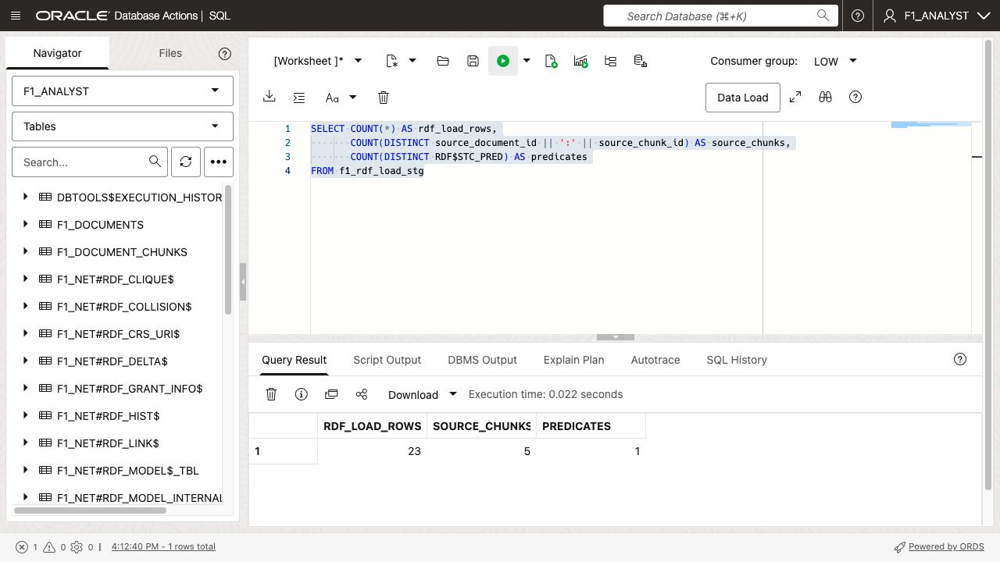
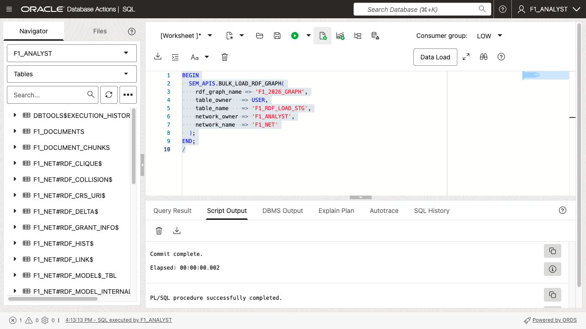
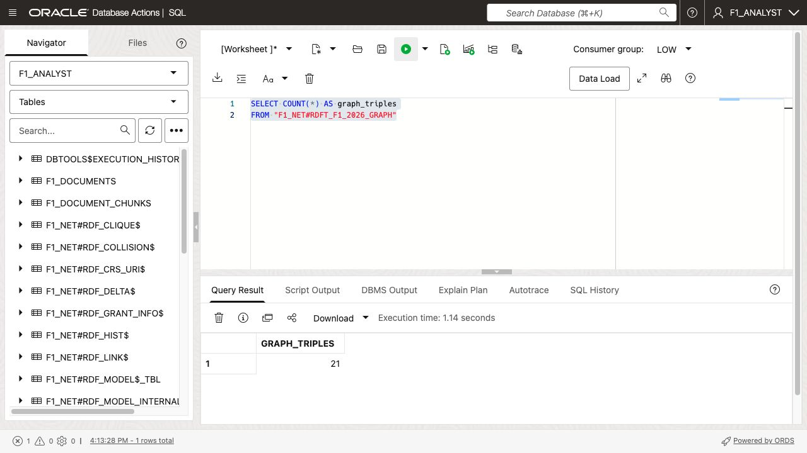

# Load and Explore the RDF Graph

## Introduction

In this lab, you will format extracted triples for Oracle RDF bulk loading, load them into the `F1_2026_GRAPH` semantic model, and inspect the graph with SPARQL. The RDF-load staging table keeps the RDF lexical form required by the semantic graph loader while retaining document and chunk provenance for later retrieval and audit.

Estimated Time: 10 minutes

### Objectives

- Format extracted triples as RDF terms.
- Bulk load an RDF semantic model.
- Query and inspect the graph with `SEM_MATCH`.

## Task 1: Create and populate the RDF loader staging table

1. Create the staging table. The four `RDF$STC_*` columns have the names expected by the RDF bulk-loading APIs; the first two columns are your provenance fields.

    ```sql
    CREATE TABLE f1_rdf_load_stg (
      source_document_id NUMBER,
      source_chunk_id    NUMBER,
      RDF$STC_SUB   VARCHAR2(4000) NOT NULL,
      RDF$STC_PRED  VARCHAR2(4000) NOT NULL,
      RDF$STC_OBJ   VARCHAR2(4000) NOT NULL,
      RDF$STC_GRAPH VARCHAR2(4000)
    );
    ```

2. Replace the namespace values with your approved F1 namespace and populate the table.

    ```sql
    INSERT INTO f1_rdf_load_stg (
      source_document_id, source_chunk_id,
      RDF$STC_SUB, RDF$STC_PRED, RDF$STC_OBJ, RDF$STC_GRAPH
    )
    SELECT document_id,
           chunk_id,
           '<https://example.com/f1/' ||
             REPLACE(SUBSTR(subject_id, INSTR(subject_id, ':') + 1), ' ', '%20') || '>',
           '<https://example.com/f1/' ||
             REPLACE(SUBSTR(predicate, INSTR(predicate, ':') + 1), ' ', '%20') || '>',
           CASE
             WHEN object_kind = 'iri' THEN
               '<https://example.com/f1/' ||
                 REPLACE(SUBSTR(object_value, INSTR(object_value, ':') + 1), ' ', '%20') || '>'
             WHEN datatype_uri IS NOT NULL THEN
               '"' || REPLACE(object_value, '"', '\\"') ||
                 '"^^<' || datatype_uri || '>'
             ELSE
               '"' || REPLACE(object_value, '"', '\\"') || '"'
           END,
           '<https://example.com/graph/f1-2026>'
    FROM f1_rdf_triples_stg;

    COMMIT;
    ```

    RDF terms must use RDF syntax: IRIs are enclosed in angle brackets, and literals are enclosed in double quotes.

    

## Task 2: Load the semantic model

1. Ensure that the `F1_2026_GRAPH` model and its semantic network already exist in your environment. Then bulk load the staging rows.

    ```sql
    BEGIN
      SEM_APIS.BULK_LOAD_RDF_GRAPH(
        rdf_graph_name => 'F1_2026_GRAPH',
        table_owner   => USER,
        table_name    => 'F1_RDF_LOAD_STG',
        network_owner => 'F1_ANALYST',
        network_name  => 'F1_NET'
      );
    END;
    /
    ```

    Your RDF administrator may use a different model or network name. Oracle's RDF bulk-loading APIs require the `RDF$STC_SUB`, `RDF$STC_PRED`, and `RDF$STC_OBJ` staging columns.

    

## Task 3: Query the graph

1. Retrieve a sample of graph triples with SPARQL through `SEM_MATCH`.

    ```sql
    SELECT f_s$rdfterm AS subject,
           f_p$rdfterm AS predicate,
           f_o$rdfterm AS object
    FROM TABLE(
      SEM_MATCH(
        'SELECT ?f_s ?f_p ?f_o WHERE { ?f_s ?f_p ?f_o }',
        SEM_MODELS('F1_2026_GRAPH'),
        NULL, NULL, NULL, NULL,
        'PLUS_RDFT=VC',
        NULL, NULL,
        'F1_ANALYST',
        'F1_NET'
      )
    )
    FETCH FIRST 25 ROWS ONLY;
    ```

    On Autonomous Database environments where Java is disabled, `SEM_MATCH`
    can return `ORA-29538: Java not installed`. The bulk load has still
    completed; verify the schema-private graph directly with:

    ```sql
    SELECT COUNT(*) AS graph_triples
    FROM "F1_NET#RDFT_F1_2026_GRAPH";
    ```

    

2. Search the staging table for a named concept, such as DRS, and note its source provenance.

    ```sql
    SELECT source_document_id, source_chunk_id,
           RDF$STC_SUB, RDF$STC_PRED, RDF$STC_OBJ
    FROM f1_rdf_load_stg
    WHERE UPPER(RDF$STC_SUB || ' ' || RDF$STC_PRED || ' ' || RDF$STC_OBJ)
          LIKE '%DRS%';
    ```

    A node being visible in the graph means that its triples were loaded. It does not, by itself, guarantee that a later vector retrieval step will select the node; that is why the next lab creates entity-focused retrieval records.

    

## Acknowledgements

- **Source** - [Loading and Exporting RDF Data](https://docs.oracle.com/en/database/oracle/oracle-database/26/rdfrm/loading-and-exporting-rdf-data.html).
- **Last Updated** - August 4, 2026
