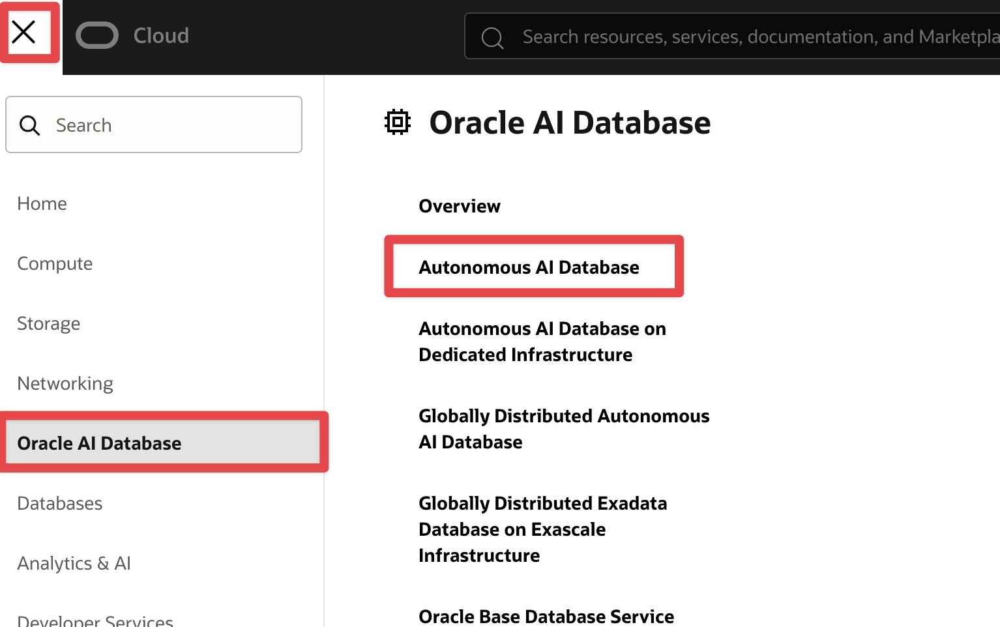
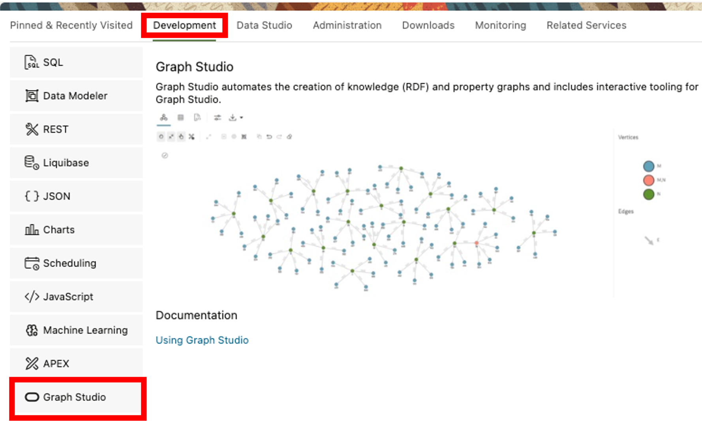
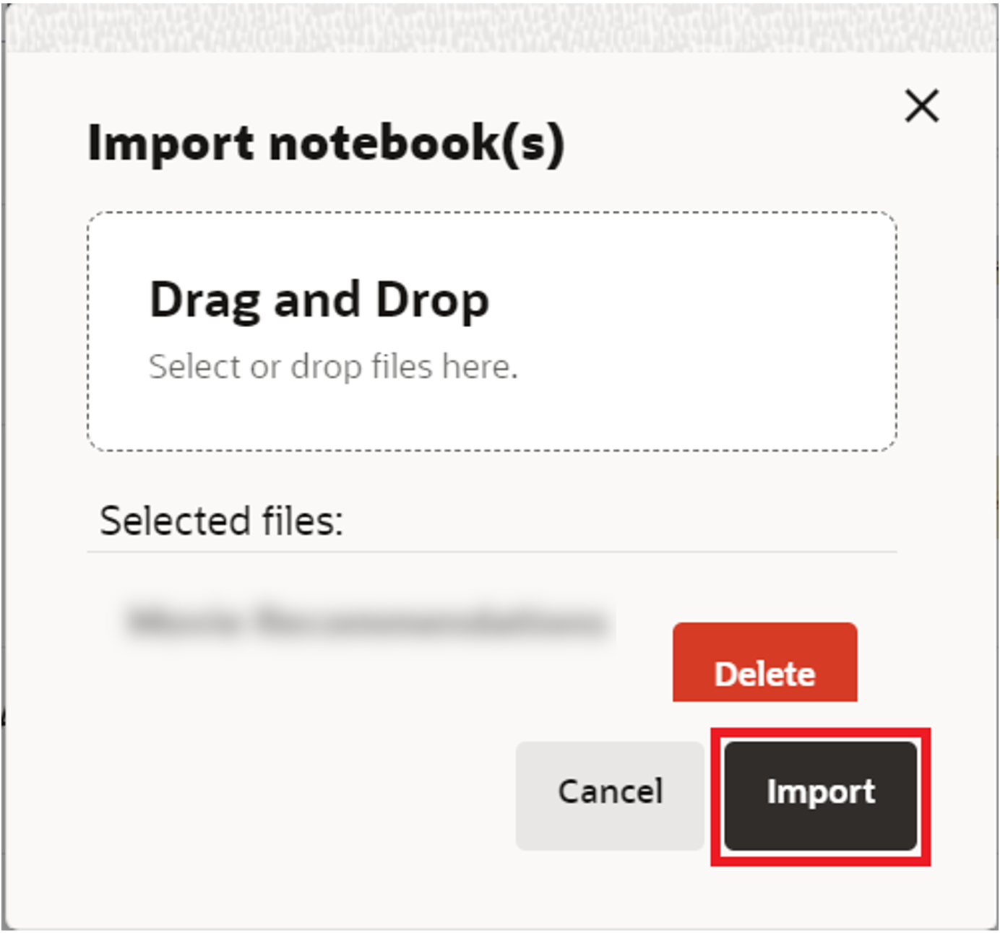

<!--
    {
        "name":"Create Graph",
        "description":"Login to Graph Studio and create an automotive orders graph for when running the tenancy the lab."
    }
-->

# Import Notebook

## Introduction

Notebooks enable you to execute code and to work interactively with long workflows. You can analyze and visualize graph results using a notebook. In this lab, we will be importing the AUTO_GRAPH notebook.

Estimated Time: 15 minutes.

### Objectives

Learn how to

- Log in to Graph Studio
- Import a notebook

### Prerequisites

- The following lab requires an Autonomous AI Database Serverless instance.
- And that a Graph-enabled user exists.

## Task 1: Log into Graph Studio

1. Click the **Navigation Menu** in the upper left, navigate to **Oracle AI Database**, and select **Autonomous AI Database**.

    

2. Select the compartment provided on **View Login Info**, and click on the **Display Name** for the **Autonomous AI Database**.

    

3. In your Autonomous Database details page, click the **Database Actions** dropdown and then choose View all database actions.

    

4. The Database Actions page opens. In the **Development** box, click **Graph Studio**.

    

    Log in using the graph user and password that appears under **View Login Info**.

    

## Task 2: Import the notebook

 You can import a notebook that has the graph queries and analytics. Each paragraph in the notebook has an explanation.  You can review the explanation, and then run the query or analytics algorithm.

  [Click here to download the notebook](https://objectstorage.us-ashburn-1.oraclecloud.com/p/1iB1cADcb2xhd-7aYIrSfv4Fnk3nj0HGDSW-G3ymyp287s0XjdSKWMl7da_QH3GT/n/oradbclouducm/b/HOL-16/o/AUTO_GRAPH.dsnb) and save it to a folder on your local computer.  This notebook includes graph queries and analytics for the AUTO_GRAPH graph.

 1. Click the **Notebook** icon. Import a notebook by clicking on the notebook icon on the left, and then clicking on the **Import** icon on the far right.

    

     Select or drag and drop the notebook and click **Import**.

    

    A dialog pops up named **Compute Environment**. It will disappear when the compute environment finishes attaching, usually in less than one minute. Or you can click **Close** to close the dialog and start working on your environment. Note that you will not be able to run any paragraph until the environment finishes attaching.

## Acknowledgements

- **Author** - Ramu Murakami Gutierrez, Product Management
- **Contributors** -  Melliyal Annamalai, Rahul Tasker, Denise Myrick, Ramu Murkami Gutierrez Product Management
- **Last Updated By/Date** - Denise Myrick, September 2025
