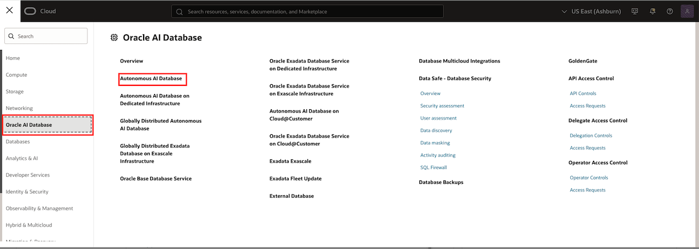
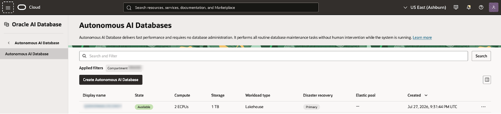
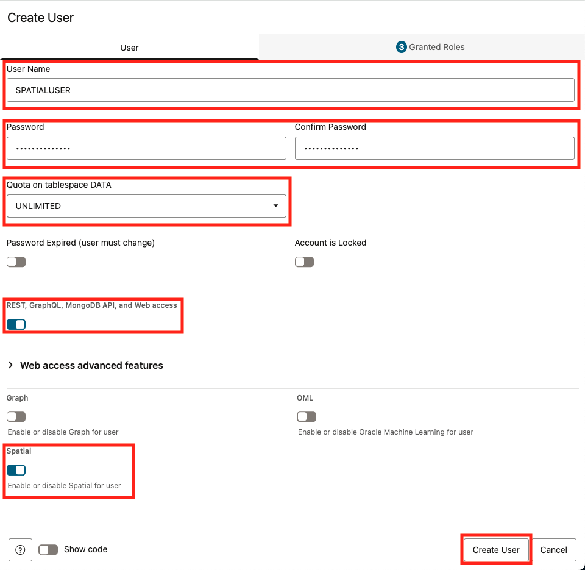
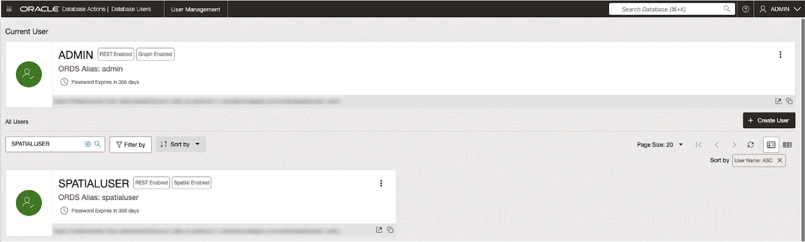
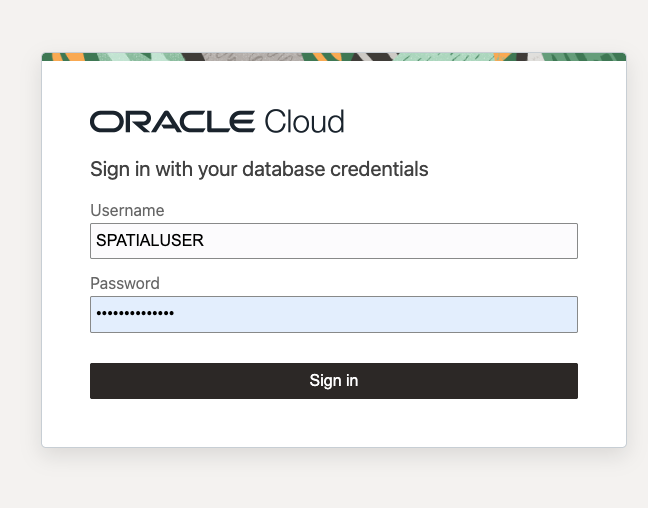
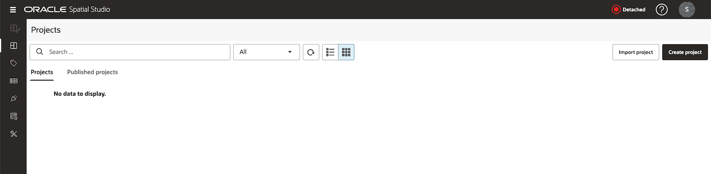

# Create User and Access Spatial Studio

## Introduction

To log into Oracle Spatial Studio on ADBS, you will need to create a user with the necessary permissions. We will do this in Database Actions, then we will launch Spatial Studio and log in.

Estimated Time: 10 minutes

### Objectives

In this lab, you will:

- Create or inspect a `SPATIAL_AUTHOR` account with Database Users.
- Access Spatial Studio from Autonomous AI Database Serverless.

## Task 1: Create a Spatial User

1. Once you've logged into Oracle Cloud, you will use the hamburger menu to navigate to Oracle AI Database, then select Autonomous AI Database.

  

2. Ensure you are in the correct compartment, and click on your database's display name. This will bring up the Autonomous AI Database information page.

  

3. Click Database Actions, then select Database Users.

  

4. Click Create User

  

5. Fill in the form. Include the username, password, select the Quota on tablespace DATA, toggle on REST, GraphQL, MongoDB API, and Web access
 and Spatial. Then click Create User.

   

6. The spatial user is now created and you can proceed to launching Spatial Studio

   

## Task 2: Launch Spatial Studio

1. Click the hamburger menu in the upper left corner to reveal the Database Actions options. In the first column, select Spatial Studio. This will open Spatial Studio in a new window.

   

2. Sign in with the credentials you created in Task 1.

   

3. You will be logged into Spatial Studio.
 
   

You may now [proceed to the next lab](#next).

## Learn More

- [Oracle Spatial product portal](https://www.oracle.com/database/spatial/)

## Acknowledgements

- **Author** - Denise Myrick, Database Product Management, Oracle
- **Last Updated By/Date** - Denise Myrick, Database Product Management, July 2026
