# Annotate the Map with Redline Tools

## Introduction

Redline tools capture operational context directly on a map without changing the source dataset. You will mark an advisory area, label an access route, edit the shapes, and export the drawing set as GeoJSON.

Estimated Time: 20 minutes

### Objectives

In this lab, you will:

- Draw point, line, and polygon Redline features.
- Edit, duplicate, resize, rotate, and annotate features.
- Save the project and export Redline features as GeoJSON.

## Task 1: Draw an advisory area and access route

1. Under Data, click **Add dataset**, then select `SERVICE_CENTERS`. Click **OK**.

  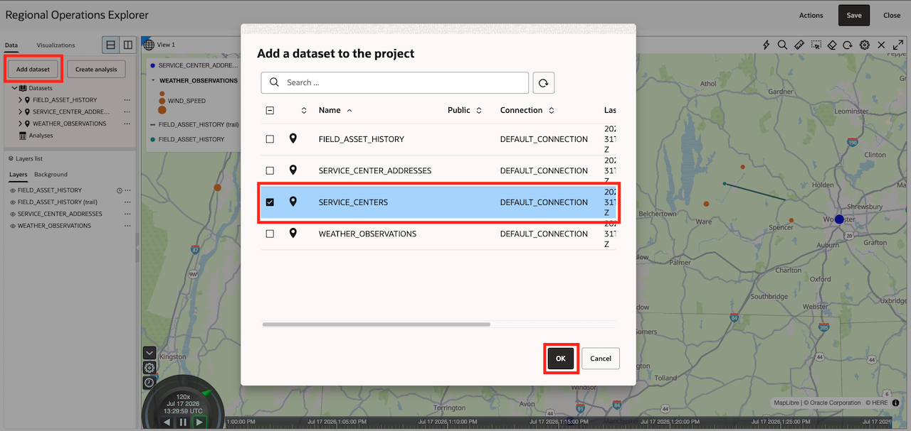

2. Drop `SERVICE_CENTERS` onto map.

  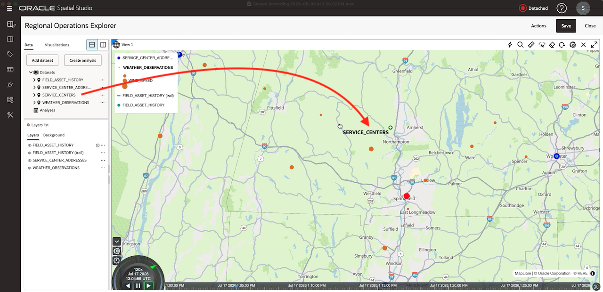

3. Select **Actions** on the map toolbar, and then select **Redline**.

  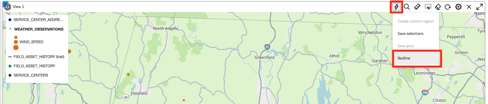

4. Select **Draw Polygon** and draw an advisory area that intersects several weather observations.

  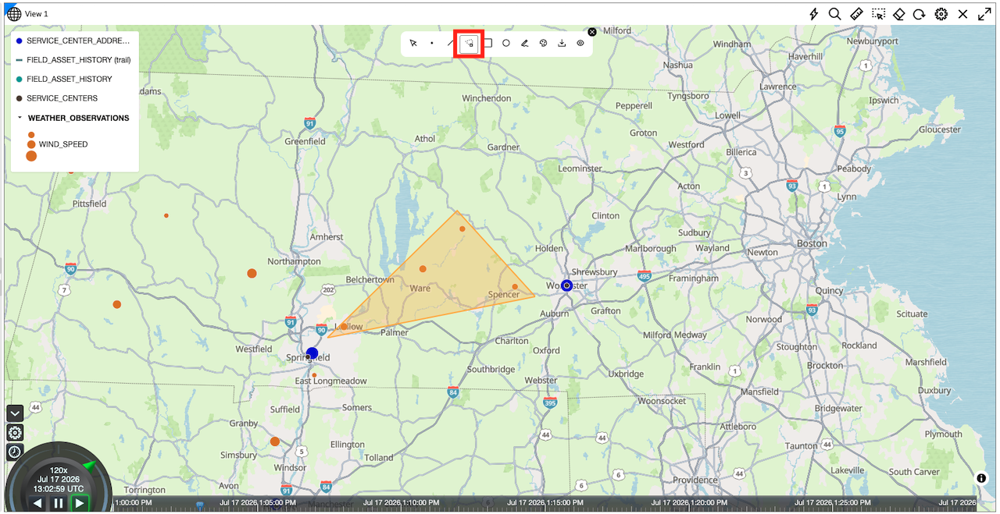

    Tip: Right-click and choose **Close polygon** to complete the drawing.

4. Select **Draw Line** and trace a possible access route from the nearest service center into the advisory area.

  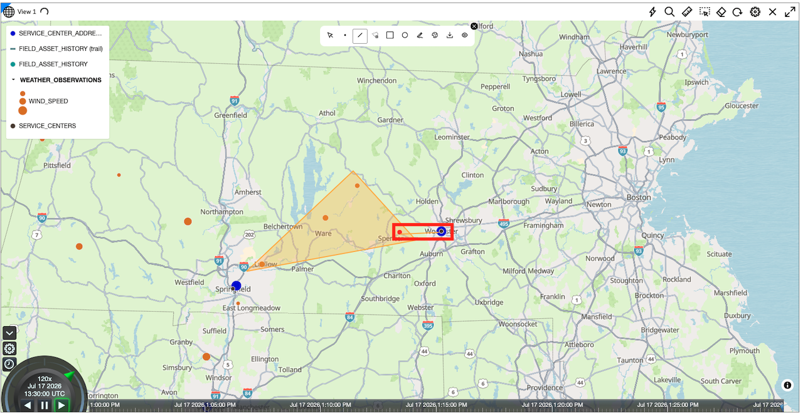

    Tip: Right-click and choose **Close polygon** to complete the drawing.

5. The orange color of the line is difficult to see. Select the line and click **Edit Feature Properties**, then choose a different color so the line stands out more. You can also change the width.

  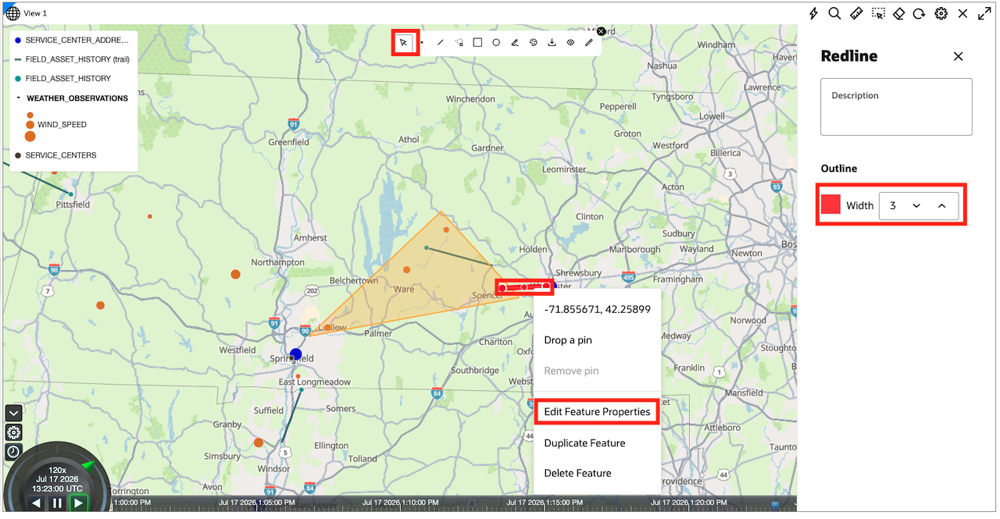

6. Select **Draw Point** to mark a proposed staging location. Select the point and click **Edit Feature Properties**, then choose a different color so the point stands out more. You can also change the width.

  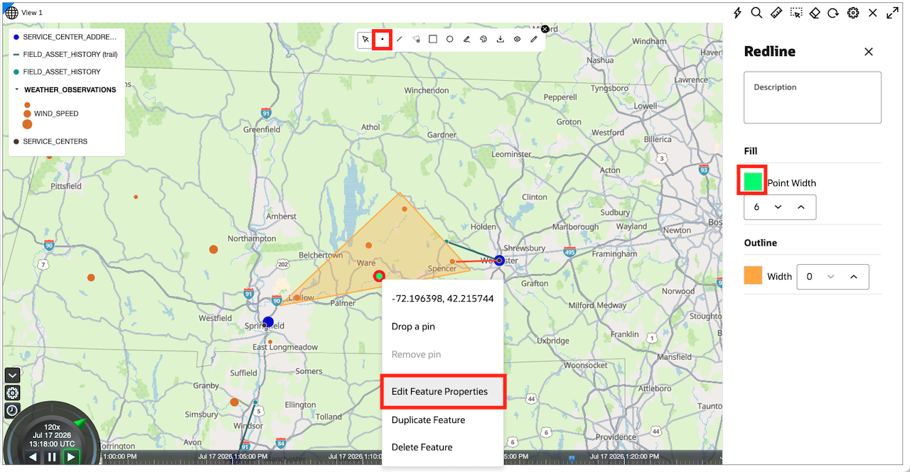

## Task 2: Edit the Redline features

1. Select **Select feature**, and then select the advisory polygon.

2. Move one or more vertices to refine its boundary.

  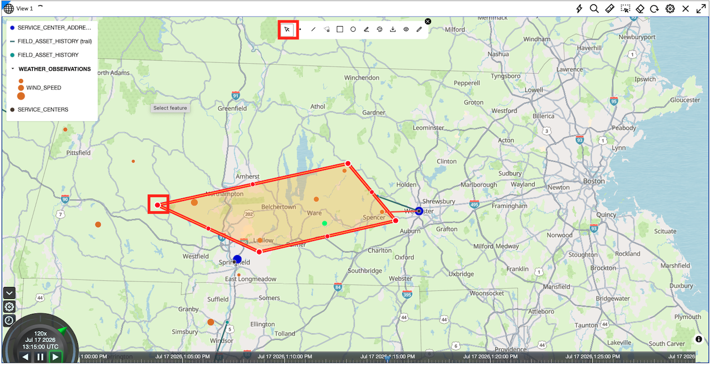

3. Open **Edit Feature Properties**, enter `Weather advisory area` as the description, and adjust its fill or outline.

  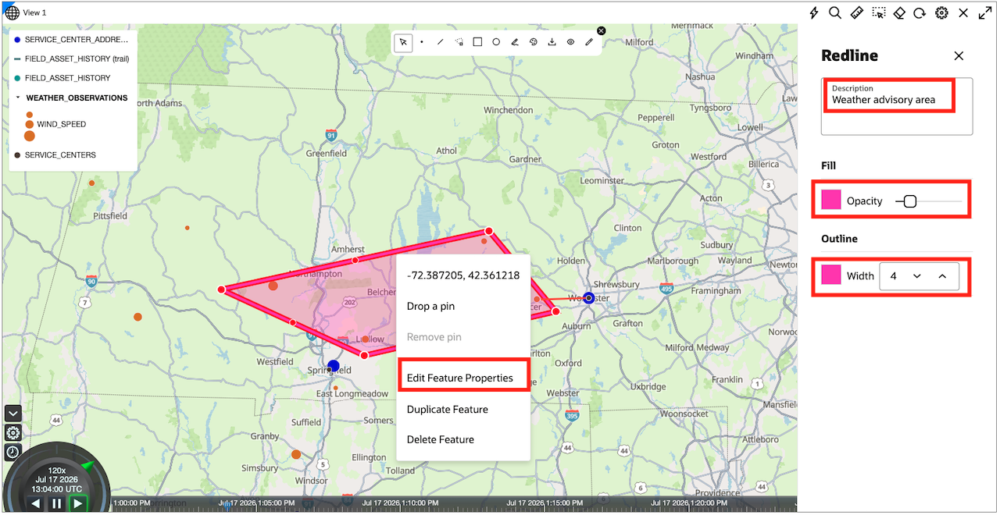

4. Select the polygon and place your mouse near one of the edges. The mouse pointer will turn into a rotation icon. Click and drag to rotate the polygon.

  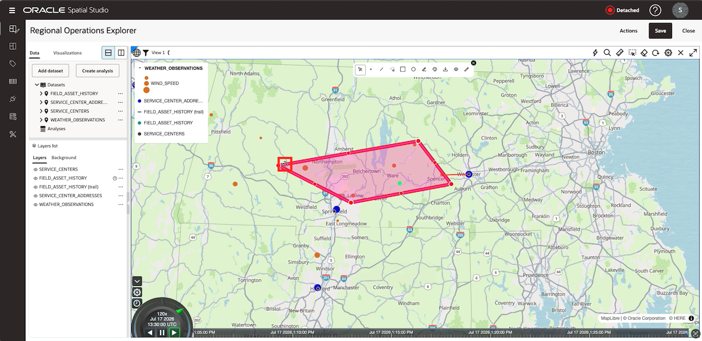

## Task 3: Toggle Visibility

1. In the Redline toolbar, select **Toggle Visibility**.

  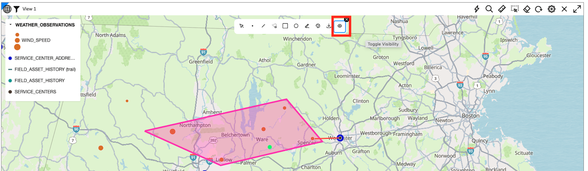

2. Observe that the shapes appear and disappear as you toggle the button.

  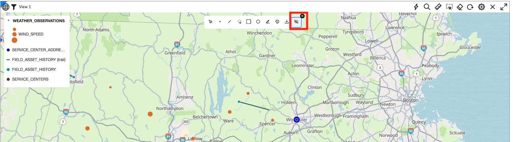

3. Select **Save** to persist the Redline drawings with the project.

You may now **proceed to the next lab**.

## Learn More

- [Use the Redline Map Tool](https://docs.oracle.com/en/cloud/paas/autonomous-database/serverless/adstu/style-map-layer1.html)

## Acknowledgements

- **Authors** - Denise Myrick, Oracle Database Product Management
- **Last Updated By/Date** - Denise Myrick, August 2026
