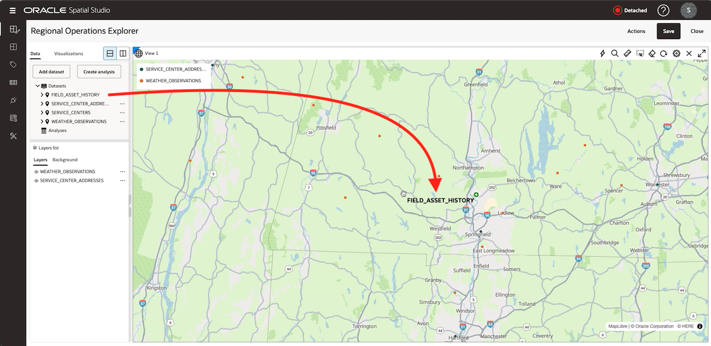

# Geocode Service Centers and Build a Base Map

## Introduction

Geocoding turns address details into a geometry that you can map and analyze. You will geocode the supplied service-center addresses, create a project, and build a map and table that answer basic operations questions.

Estimated Time: 25 minutes

### Objectives

In this lab, you will:

- Geocode an address dataset and verify its result.
- Create and save a Spatial Studio project.
- Add operational datasets to a map.
- Style point layers and inspect records in a table.

## Task 1: Geocode the service-center addresses

1. Open **Datasets**, open the menu for `SERVICE_CENTER_ADDRESSES`, select **Prepare**, and then select **Geocode Addresses**.

  

2. On the **Setup** tab, keep **Single column address** off. Map `ADDRESS`, `CITY`, `STATE`, `POSTAL_CODE`, and `COUNTRY` to the matching address components.

  

3. Switch **Save coordinates in columns** on. Enter `LATITUDE` and `LONGITUDE` as the output column names, then select **Apply**.

  

4. Open **Jobs** and wait for the geocoding job to finish. If a row fails, inspect its address fields before rerunning the job.

  

5. Open the dataset properties and confirm that `GC_GEOMETRY` is present as an `SDO_GEOMETRY` column.

  

## Task 2: Create the project

1. Open **Projects** and select **Create Project**.

  

2. Click **Actions**, and then **Save project as...**. Enter `Regional Operations Explorer` as the project name and enter `Movement, weather, wind, and response coverage` as the description.

  

3. Select **Save**, and then save the project.

  

## Task 3: Add the uploaded datasets

1. In the active project, open the **Data** tab and select **Add Dataset**.

  

2. Select `SERVICE_CENTER_ADDRESSES`, `SERVICE_CENTERS`, `FIELD_ASSET_HISTORY`, and `WEATHER_OBSERVATIONS`, and then select **OK**.

  

3. From **Data**, drag `SERVICE_CENTER_ADDRESSES` onto the map.

  

4. Drag `WEATHER_OBSERVATIONS` onto the same map.

  

5. Drag `FIELD_ASSET_HISTORY` onto the map.

  

    Spatial Studio renders later layers above earlier layers. Use the Layers list to change visibility while you inspect each dataset.

      

## Task 4: Style and inspect the layers

1. Open the `SERVICE_CENTER_ADDRESSES` layer menu, select **Settings**, and choose a distinct point color and a larger radius.

  
  

2. Open the `WEATHER_OBSERVATIONS` layer settings and apply data-driven color using `WIND_SPEED`.

  
  
  

3. Open **Visualizations** and drag **Table** next to the map.

  

4. Add `SERVICE_CENTER_ADDRESSES` to the table and select a row.

  

5. Confirm that Spatial Studio highlights the matching map feature or lets you locate it from the selected table record.

  

6. Save the project.

## Learn More

- [Typical Workflow for Visualizing Spatial Data](https://docs.oracle.com/en/cloud/paas/autonomous-database/serverless/adstu/typical-workflow-visualizing-spatial-data.html)
- [Geocode a Dataset](https://docs.oracle.com/en/cloud/paas/autonomous-database/serverless/adstu/geocode-dataset.html)
- [Using Oracle Spatial Studio on Autonomous AI Database, Release 26.1](https://docs.oracle.com/en/cloud/paas/autonomous-database/serverless/adstu/get-started-using-spatial-studio1.html)

## Acknowledgements

* **Authors** - Oracle LiveLabs
* **Last Updated By/Date** - Oracle LiveLabs, July 2026
* **Source** - [Typical Workflow for Visualizing Spatial Data](https://docs.oracle.com/en/cloud/paas/autonomous-database/serverless/adstu/typical-workflow-visualizing-spatial-data.html)
