# Load Wind Data, Geocode Service Centers, and Build a Base Map

## Introduction

Geocoding turns address details into geometry that you can map and analyze. You will also load an R/G-encoded wind image into GeoRaster and create the wind dataset used later in the workshop. You will then create a project and build a base map.

Estimated Time: 25 minutes

### Objectives

In this lab, you will:

- Geocode an address dataset and verify its result.
- Load a wind image into Oracle Spatial GeoRaster.
- Create the `REGIONAL_WIND_FLOW` dataset.
- Create and save a Spatial Studio project.
- Add operational datasets to a map.
- Style point layers and inspect feature attributes on the map.

## Task 1: Geocode the service-center addresses

1. Open **Datasets**, open the menu for `SERVICE_CENTER_ADDRESSES`, select **Prepare**, and then select **Geocode Addresses**.

  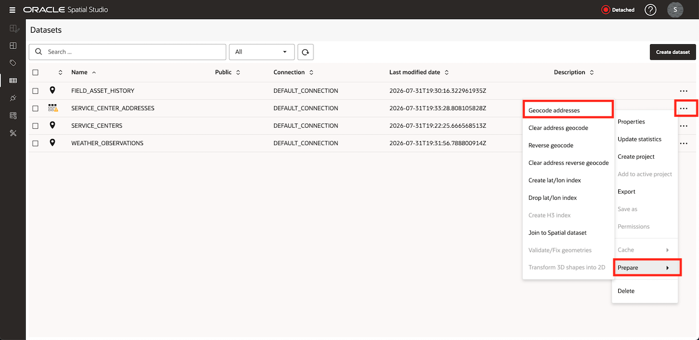

2. On the **Setup** tab, keep **Single column address** off. Map `ADDRESS`, `CITY`, `STATE`, `POSTAL_CODE`, and `COUNTRY` to the matching address components.

  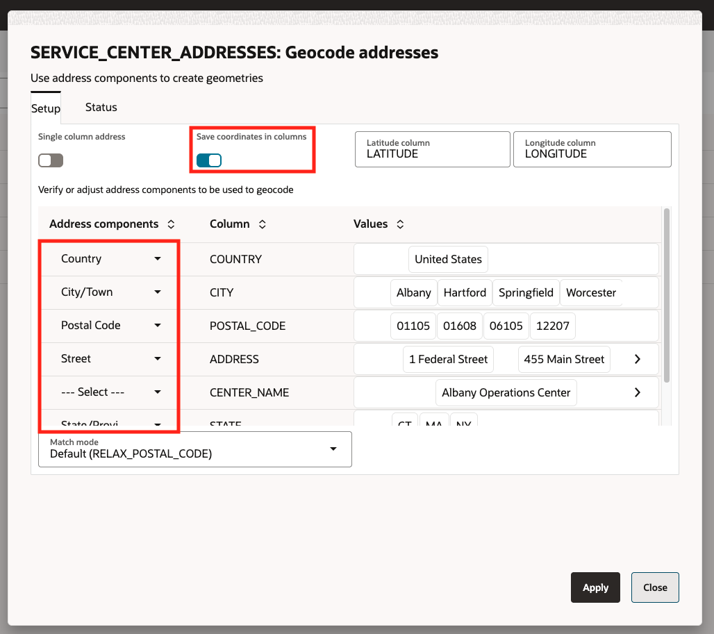

3. Switch **Save coordinates in columns** on. Enter `LATITUDE` and `LONGITUDE` as the output column names, then select **Apply**.

  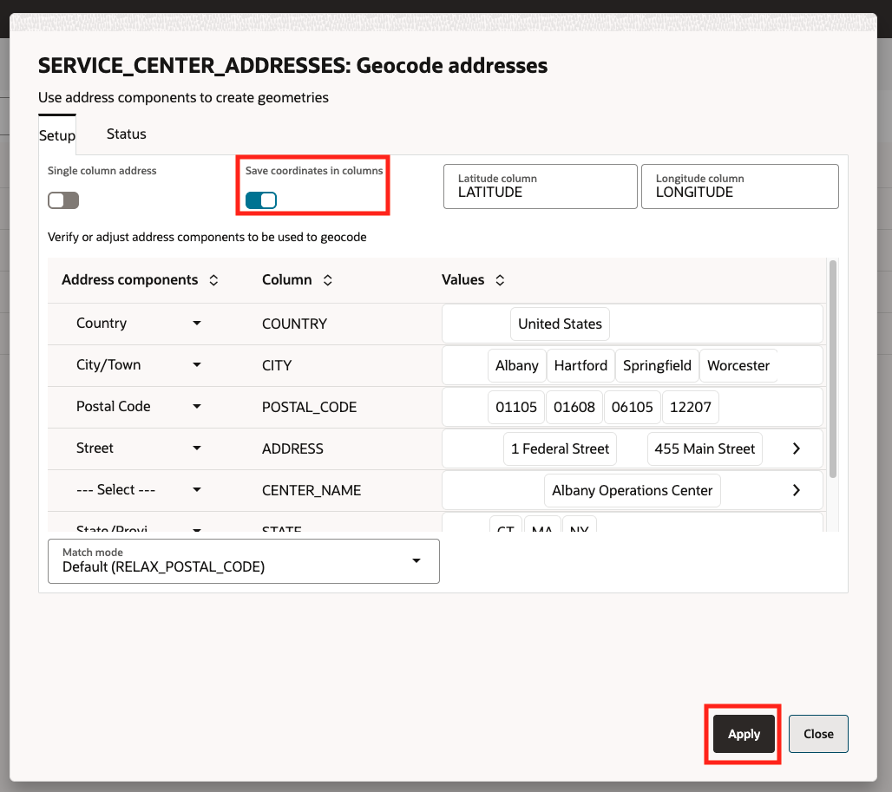

4. Open **Jobs** and wait for the geocoding job to finish. If a row fails, inspect its address fields before rerunning the job.

  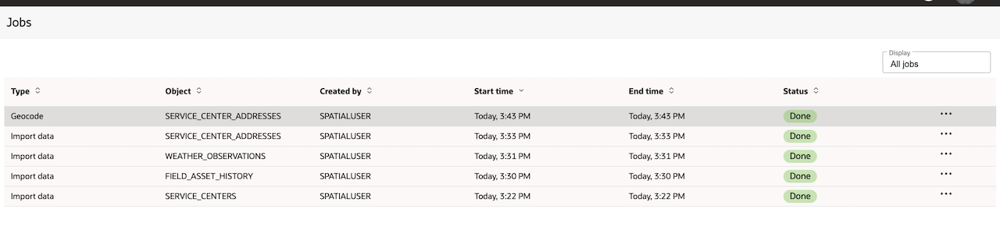

5. Open the dataset properties and confirm that `GC_GEOMETRY` is present as an `SDO_GEOMETRY` column.

  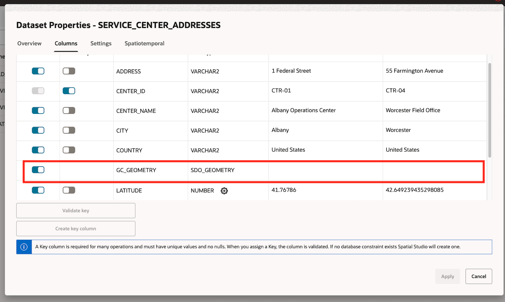

## Task 2: Load the wind image into GeoRaster

1. Obtain the following workshop values from your instructor:

    - The Object Storage pre-authenticated request URL for the encoded wind image
    - The relative object path, if the URL grants access to a bucket instead of one object
    - The image SRID and bounding coordinates, unless the image contains supported spatial metadata
    - The minimum and maximum `u` and `v` speed values

    Treat the PAR URL as a temporary credential. Do not paste it into workshop notes, screenshots, or chat.

2. Confirm that the Spatial Studio header shows the dedicated compute node as **Attached**. If it shows **Detached**, ask the instructor to attach the workshop compute node before continuing.

3. Open **Datasets**, select **Create Dataset**, and then select **Imagery file via PAR URL**.

4. Enter the instructor-provided PAR URL. Enter the relative object path only when the URL points to a bucket, then select **Create**.

5. Review the `gdalinfo` output. Confirm that Spatial Studio detects the image dimensions, bands, and spatial metadata without errors, then select **Next**.

6. Keep **Create GeoRaster dataset** off. This task loads the image into a GeoRaster table; you will create the wind dataset in Task 3.

7. Select your workshop database link, choose **Create new GeoRaster table**, and enter `REGIONAL_WIND_GEORASTER` as the table name.

8. Enter `1` as the key, enter `Regional operations wind field` as the summary, and create a raster data table named `REGIONAL_WIND_RDT`.

9. Use the spatial metadata detected in the image. If Spatial Studio does not detect it, enter the SRID and bounding coordinates supplied by the instructor.

10. Retain the remaining storage defaults, review the summary, and select **OK**.

11. Open **Jobs** and wait for the GeoRaster load to finish successfully.

## Task 3: Create the wind dataset

1. Return to **Datasets**, select **Create Dataset**, and then select **Database table/view**.

2. Select your workshop database link and select **Create**.

3. Open **GeoRasters**, select `REGIONAL_WIND_GEORASTER`, and select **OK**.

4. Set **Selection Mode** to **Single Raster** and switch **Wind Animation** on.

5. Enter the instructor-provided minimum and maximum values for the `u` and `v` speed components.

6. Select **OK** to create the dataset.

7. If Spatial Studio assigns a different display name, open the dataset properties and rename it `REGIONAL_WIND_FLOW`.

8. Confirm that `REGIONAL_WIND_FLOW` appears on the Datasets page and that its GeoRaster properties show **Wind Animation** enabled.

## Task 4: Create the project

1. Open **Projects** and select **Create Project**.

  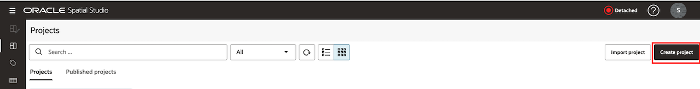

2. Click **Actions**, and then **Save project as...**. Enter `Regional Operations Explorer` as the project name and enter `Movement, weather, wind, and response coverage` as the description.

  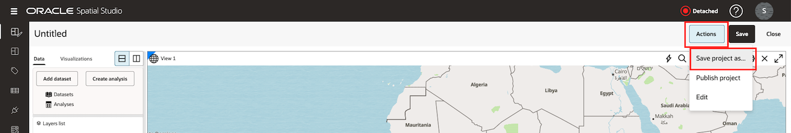

3. Select **Save**, and then save the project.

  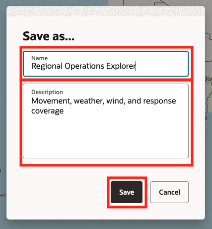

## Task 5: Add the uploaded datasets

1. In the active project, open the **Data** tab and select **Add Dataset**.

  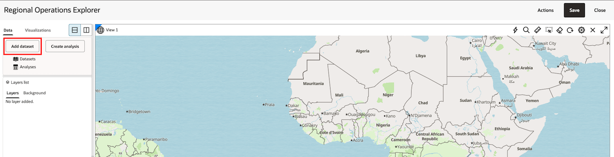

2. Select `SERVICE_CENTER_ADDRESSES`, `SERVICE_CENTERS`, and `WEATHER_OBSERVATIONS`, and then select **OK**.

  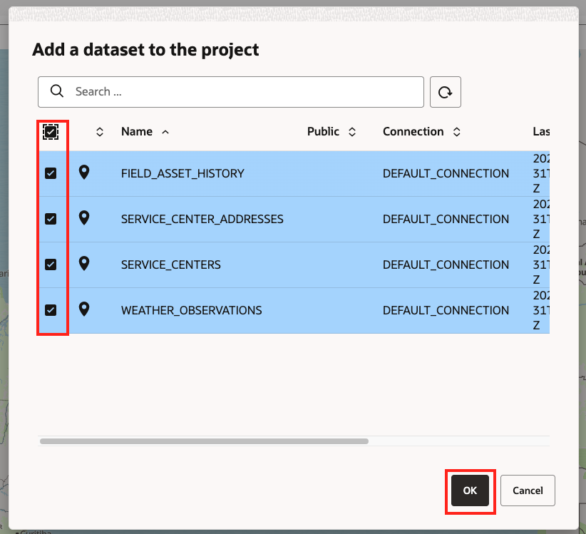

3. From **Data**, drag `SERVICE_CENTER_ADDRESSES` onto the map.

  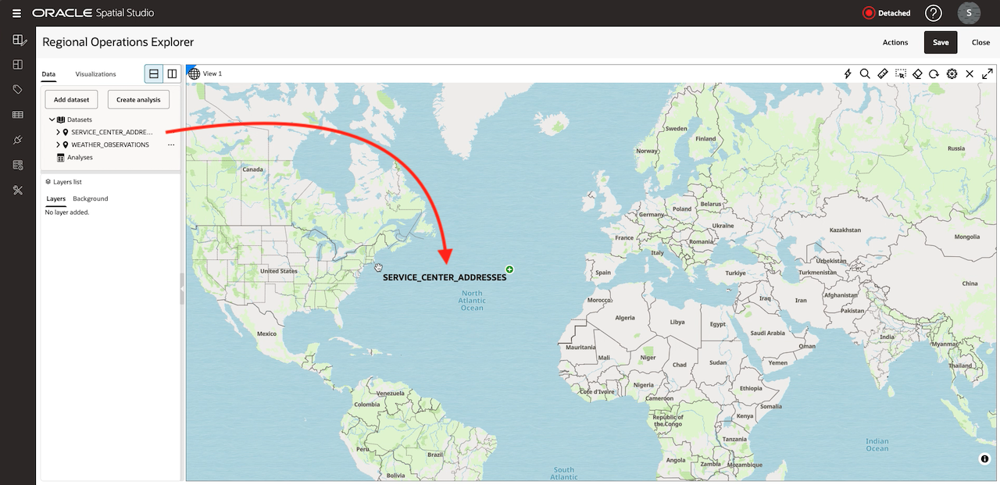

4. Drag `WEATHER_OBSERVATIONS` onto the same map.

  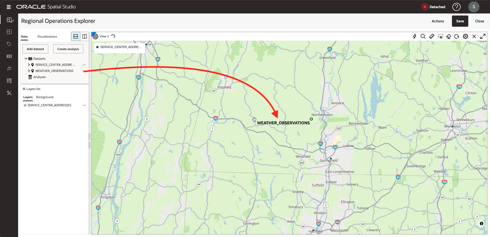

5. Spatial Studio renders later layers above earlier layers. Use the Layers list to change visibility while you inspect each dataset.

      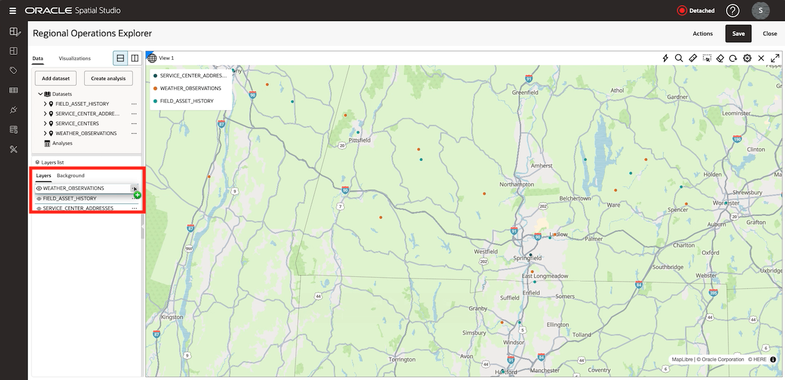

## Task 6: Style and inspect the layers

1. Open the `SERVICE_CENTER_ADDRESSES` layer menu, select **Settings**, and choose a distinct point color and a larger radius.

  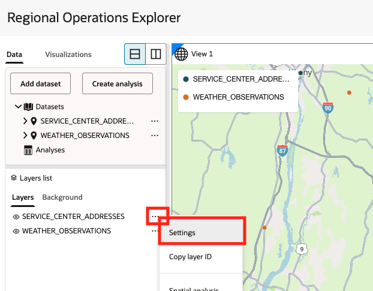
  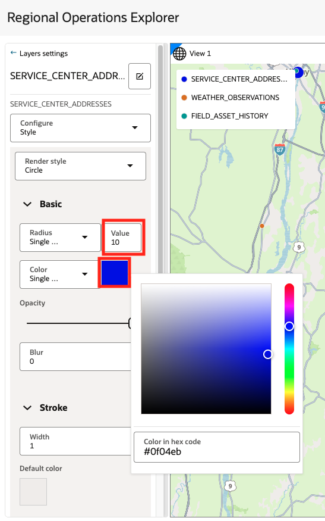

2. Open the `WEATHER_OBSERVATIONS` layer settings and apply data-driven color using `WIND_SPEED`. Use **back arrow** to return to **Data**.

  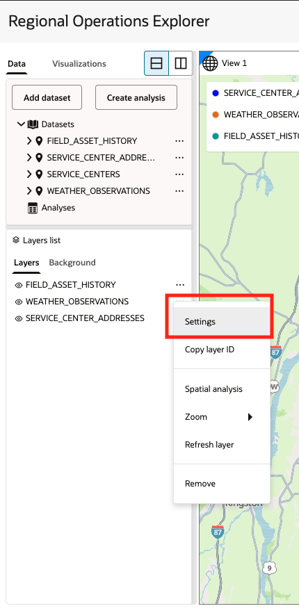
  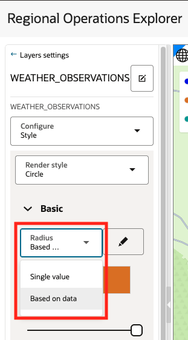
  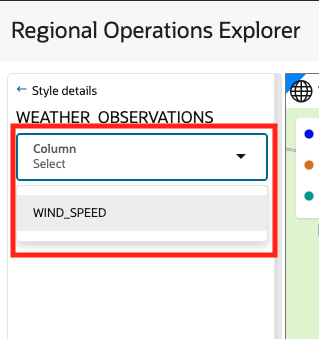

3. Open **Visualizations** and drag **Table** next to the map.

  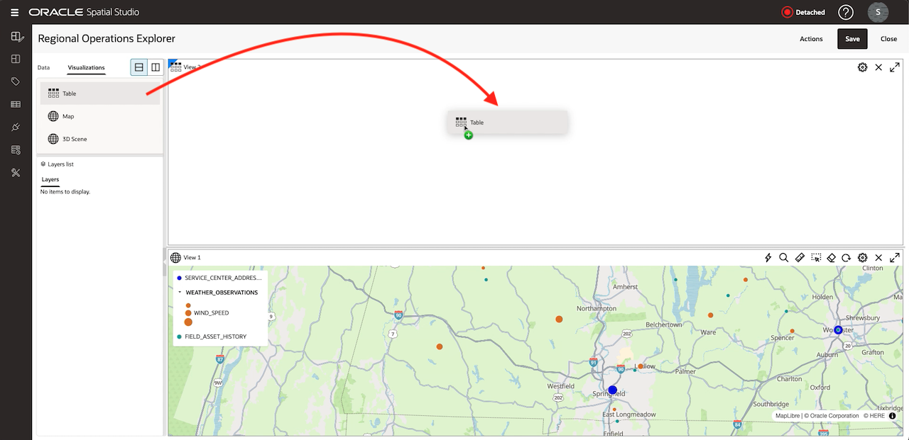

4. Add `SERVICE_CENTER_ADDRESSES` to the table and select a row.

  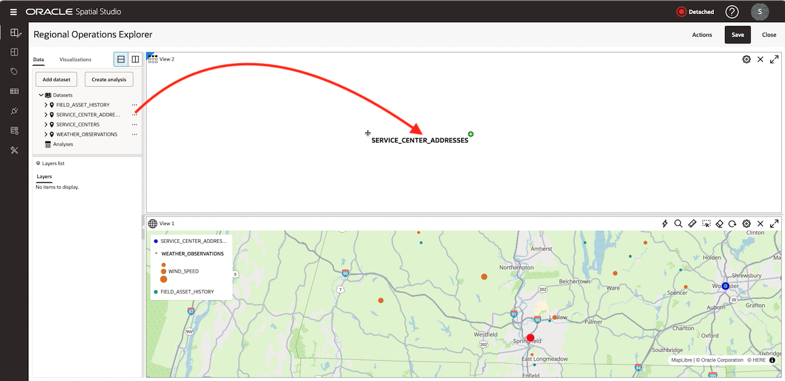

5. Confirm that Spatial Studio highlights the matching map feature or lets you locate it from the selected table record.

  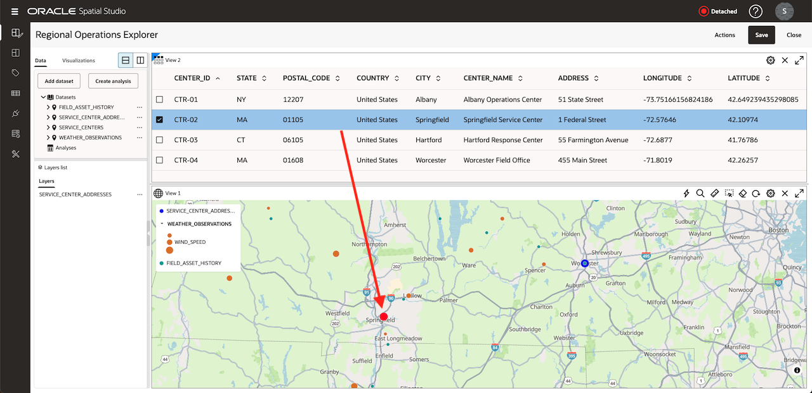

6. Remove table as it will not be used in follow on labs.

  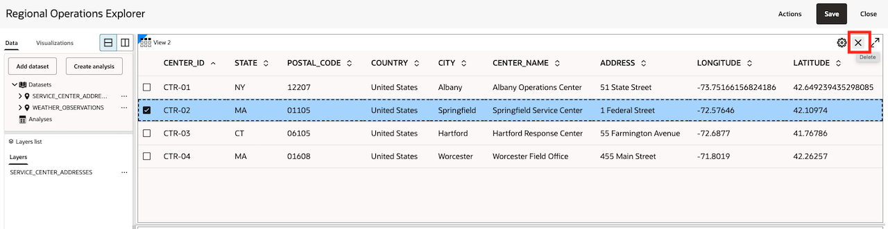

7. Save the project.

## Learn More

- [Typical Workflow for Visualizing Spatial Data](https://docs.oracle.com/en/cloud/paas/autonomous-database/serverless/adstu/typical-workflow-visualizing-spatial-data.html)
- [Geocode a Dataset](https://docs.oracle.com/en/cloud/paas/autonomous-database/serverless/adstu/geocode-dataset.html)
- [Using Oracle Spatial Studio on Autonomous AI Database, Release 26.1](https://docs.oracle.com/en/cloud/paas/autonomous-database/serverless/adstu/get-started-using-spatial-studio1.html)

## Acknowledgements

- **Authors** Denise Myrick, Oracle Database Product Management
-* **Last Updated By/Date** - Denise Myrick, Oracle Database Product Management, August 2026
