# Summarize Coverage with H3 and Proximity Analysis

## Introduction

H3 aggregation turns many point observations into a readable hexagonal coverage layer. You will summarize weather observations, then filter the results to identify readings near service centers for response planning.

Estimated Time: 30 minutes

### Objectives

In this lab, you will:

- Create and style an H3 aggregation dataset.
- Validate the input geometries.
- Run a proximity analysis.

## Task 1: Create an H3 coverage layer

1. Open **Datasets**, and open the menu for `WEATHER_OBSERVATIONS`.

2. Select **Prepare**, and then select **Create H3 Index**.

  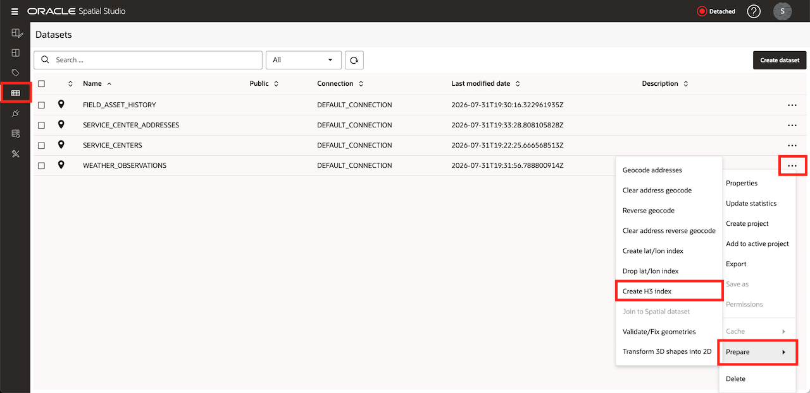

3. Select the dataset geometry column and select **Count** as the summarize option.

4. Name the result `WEATHER_OBSERVATIONS_H3` and select **OK**.

  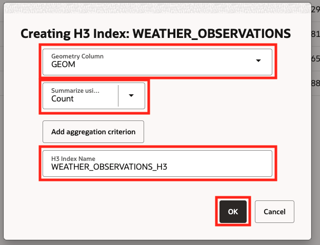

5. Wait for the H3 dataset to appear. Add it to `Regional Operations Explorer` and drag it onto the map.

  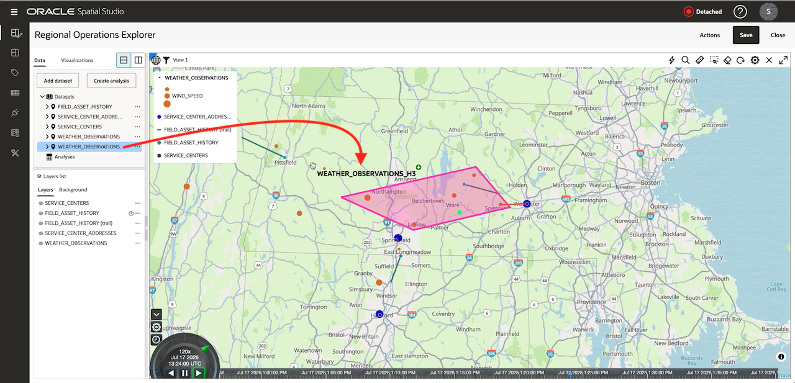

6. Open the H3 layer settings and apply data-driven color using the count field. Zoom in and out to compare the hexagonal coverage pattern.

  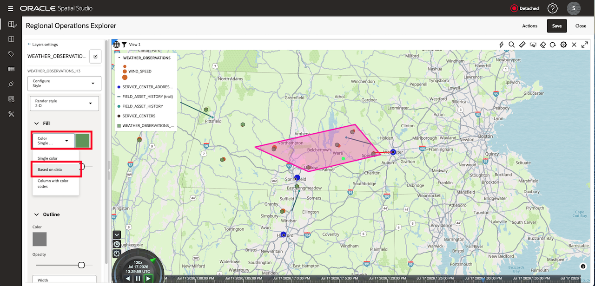
  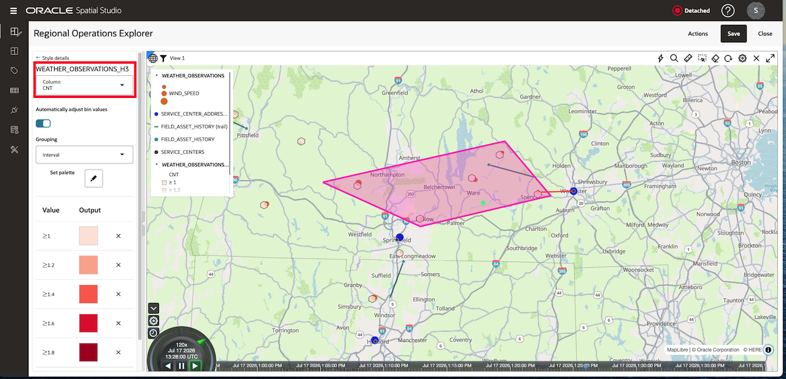

    H3 summarizes the input points in a hierarchy of hexagonal cells. The result is most useful for finding concentration patterns, not for replacing the original weather readings.

## Task 2: Validate the input datasets

1. Save the project and open **Datasets**.

2. Open the menu for `SERVICE_CENTERS`, select **Prepare**, and then select **Validate/Fix geometries**.

  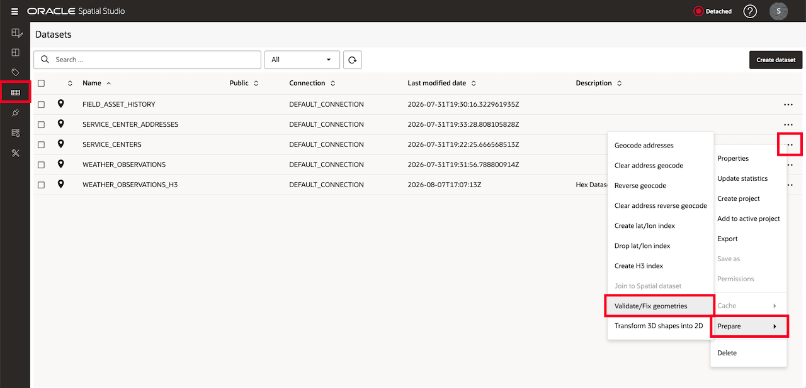

3. Run the geometry check and confirm that the dataset has no unresolved invalid geometries.

  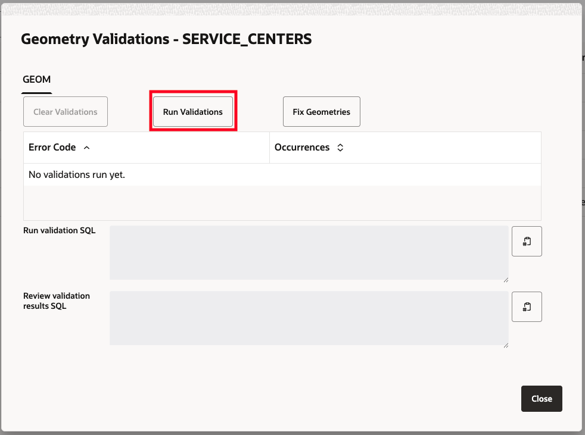

4. Repeat the geometry check for `WEATHER_OBSERVATIONS`.

  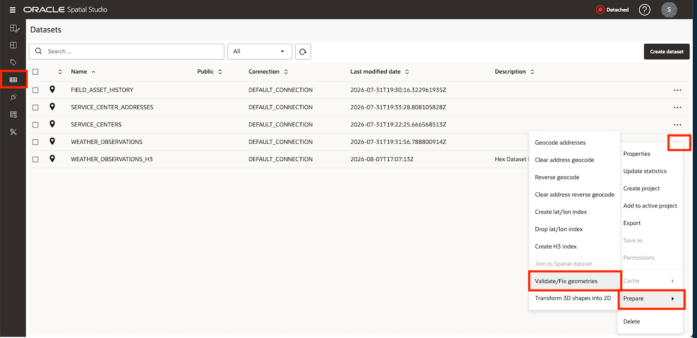
  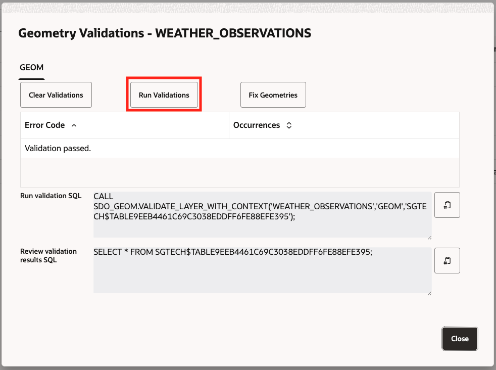

5. Reopen `Regional Operations Explorer` and make both source layers visible.

## Task 3: Find observations within a specified distance

1. Open the `WEATHER_OBSERVATIONS` layer menu and select **Spatial Analysis**.

  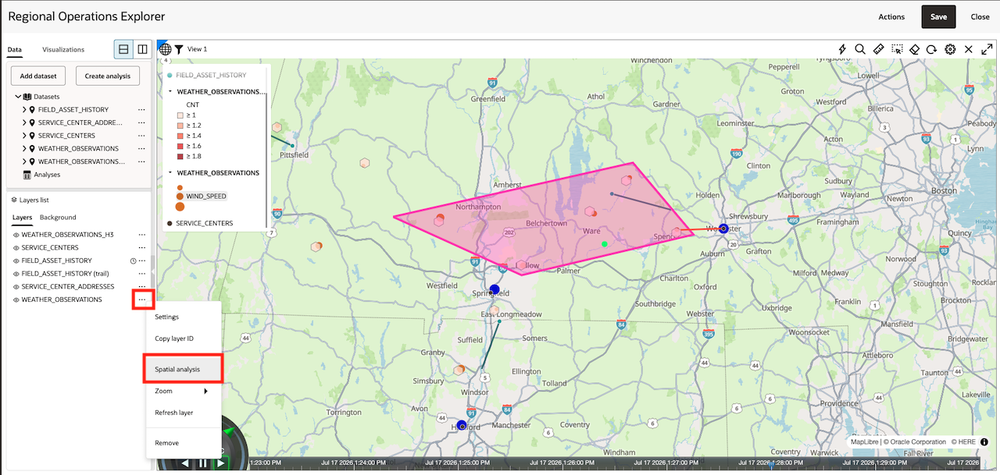

2. Open the **Filter** category and select **Return shapes within a specific distance of another**.

  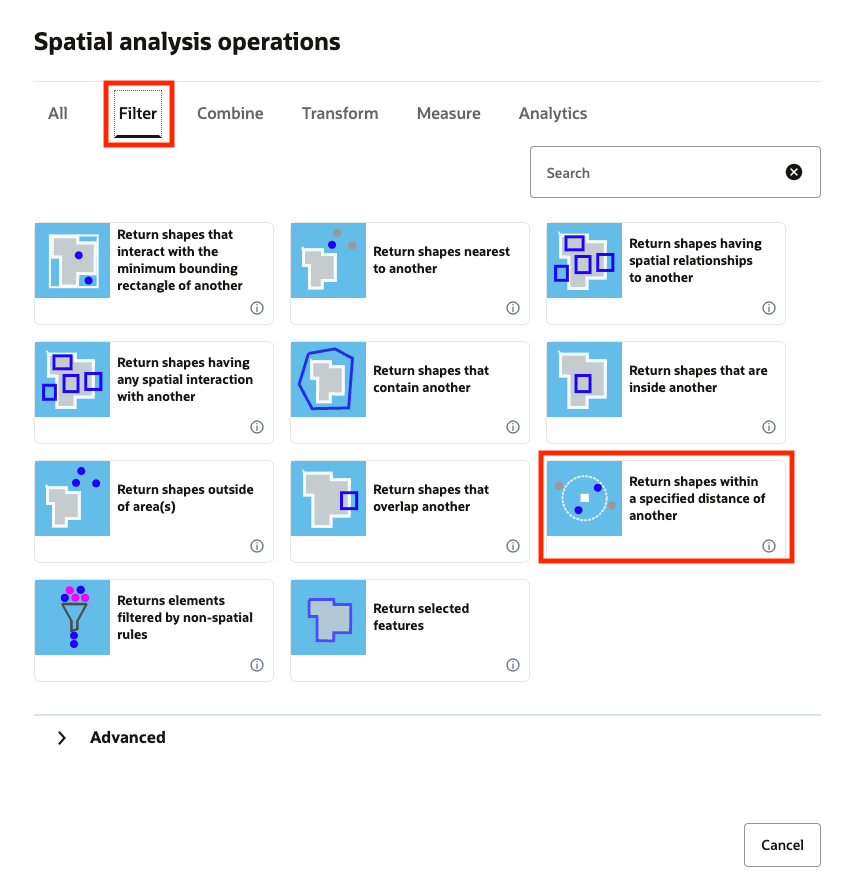

3. Name the analysis `WEATHER_WITHIN_25_KM`.

4. Select `WEATHER_OBSERVATIONS` as the layer to filter.

5. Select `SERVICE_CENTERS` as the filter layer.

6. Enter `25` and select kilometer as the unit.

7. Select **Run** and wait for the analysis result to appear under Analyses.

  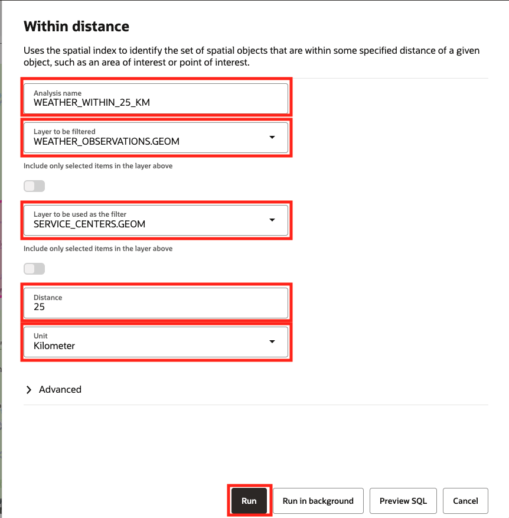

8. Drag `WEATHER_WITHIN_25_KM` onto the map and apply a distinct color.

  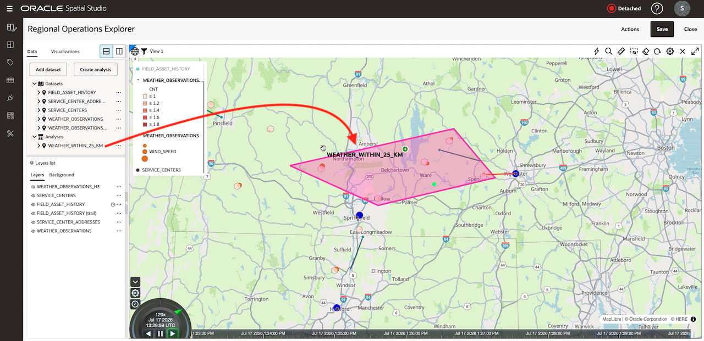

9. Toggle the result layer to compare included and excluded observations.

## Task 4: Review and save the project

1. Display `WEATHER_WITHIN_25_KM`, `WEATHER_OBSERVATIONS_H3`, and the original observations together.

  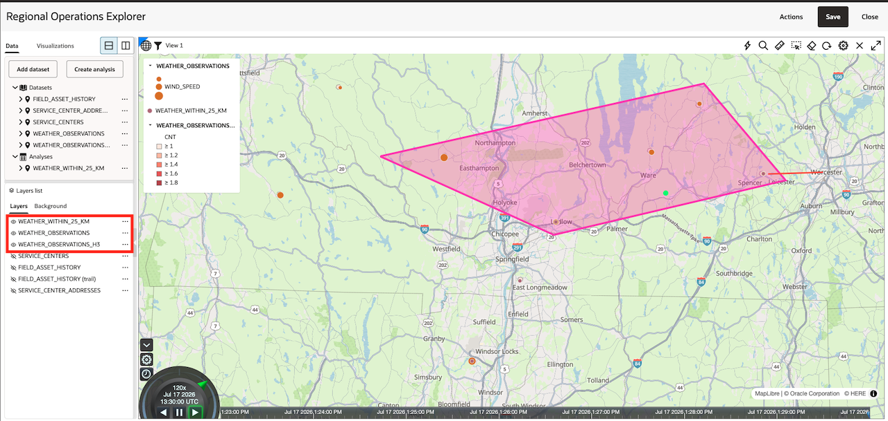

2. Compare the analysis result with the wind flow, H3 clusters, and asset history.

  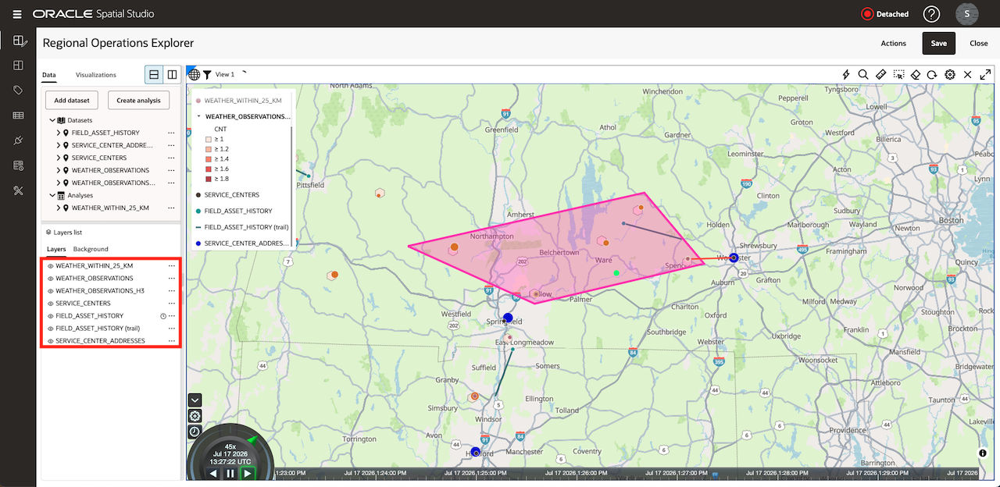

3. Save `Regional Operations Explorer`.

  

4. Confirm that both derived datasets appear on the Datasets page and remain available to another project.

  

You may now **proceed to the next step**.

## Learn More

- [Prepare an H3 Aggregation Dataset](https://docs.oracle.com/en/cloud/paas/autonomous-database/serverless/adstu/prepare-dataset-h3-aggregation.html)
- [Overview of the Datasets Page](https://docs.oracle.com/en/cloud/paas/autonomous-database/serverless/adstu/overview-datasets-page.html)

## Acknowledgements

- **Authors** - Denise Myrick, Oracle Database Product Management
- **Last Updated By/Date** - Denise Myrick, August 2026
