# Explore Historical Asset Movement

## Introduction

Time reveals how field assets moved through the operating area. You will configure field-asset history as a non-live moving-object dataset and inspect its timeline before moving into aggregation and analysis.

Estimated Time: 25 minutes

### Objectives

In this lab, you will:

- Enable historical spatiotemporal behavior for moving assets.
- Add asset history to the project timeline.

## Task 1: Configure the historical asset dataset

1. Save and close the active project, and then open **Datasets**.

  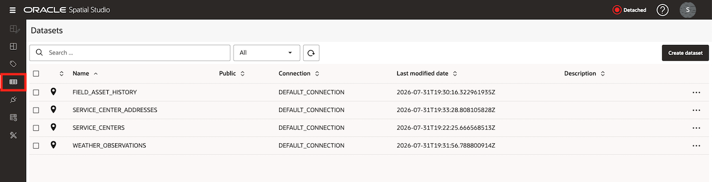

2. Open the properties for `FIELD_ASSET_HISTORY`.

  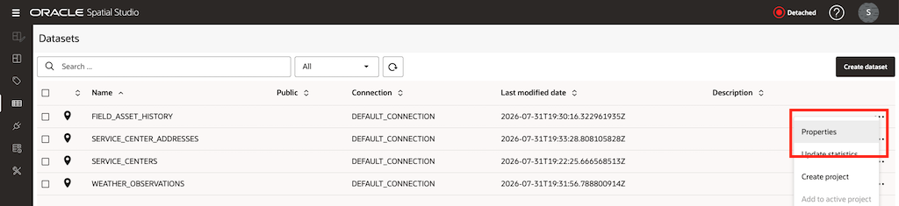

3. Locate the spatiotemporal settings and switch **Enable spatiotemporal** on. Select `OBSERVED_AT` as the timestamp column. Switch **Data is live** off and switch **Moving objects** on. Select `ASSET_ID` as the entity identifier and use seconds as the time unit.

  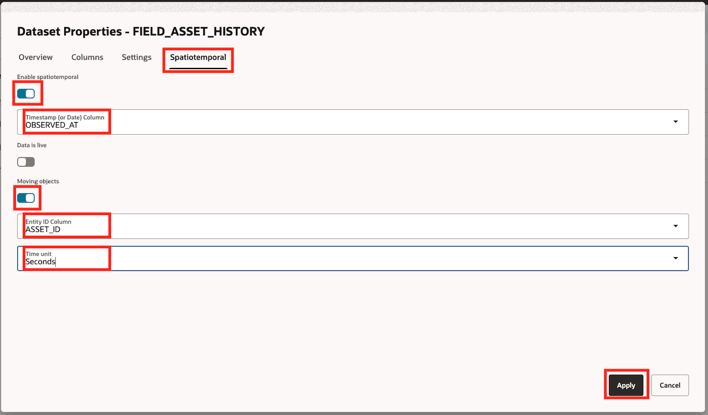

4. Apply the changes.

    The workshop timestamps use UTC. Spatial Studio expects UTC or GMT timestamps for moving-object visualization.

## Task 2: Add asset history to the timeline

1. Reopen `Regional Operations Explorer`. Open the **Data** tab, select **Add Dataset**, choose `FIELD_ASSET_HISTORY`, and select **OK**.

  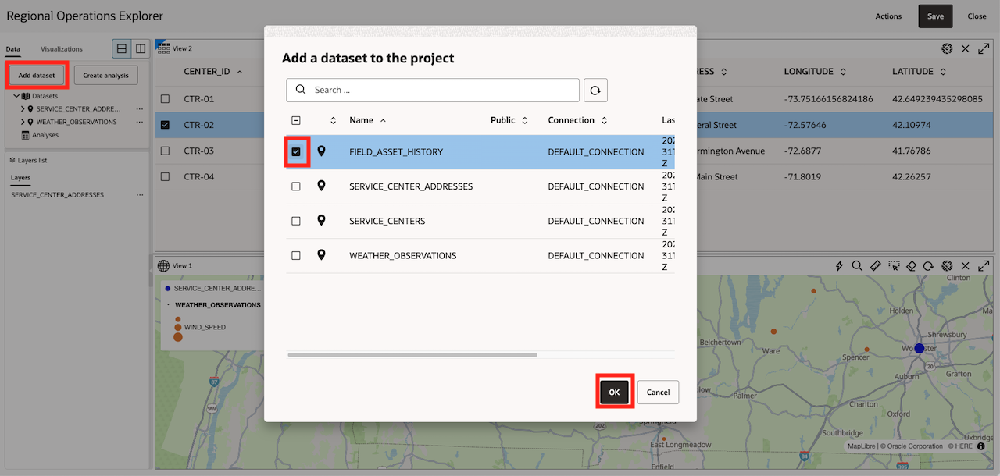

2.  Drag `FIELD_ASSET_HISTORY` from the Data tab onto the map.

  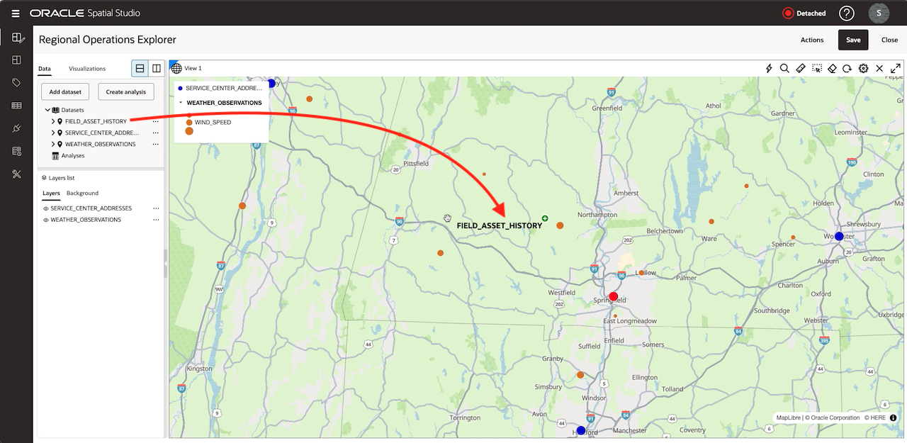

3. Open the map settings, switch **Show timeline** on, and apply the setting.

  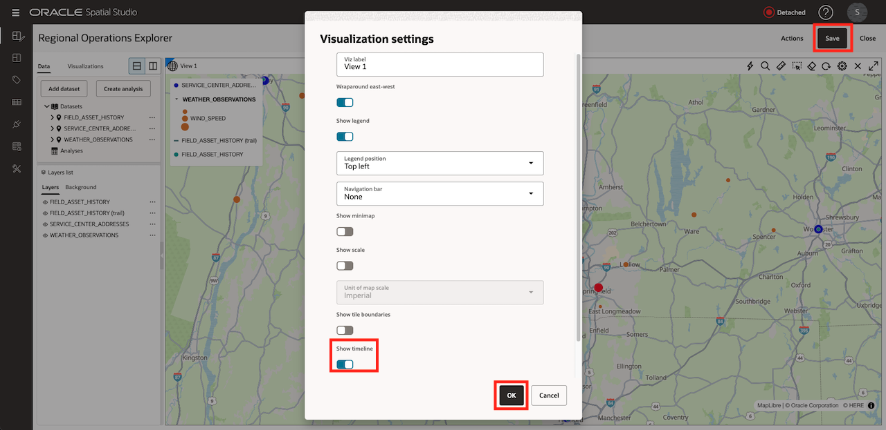

4. Open the primary `FIELD_ASSET_HISTORY` layer menu and select **Add to Timeline**.

  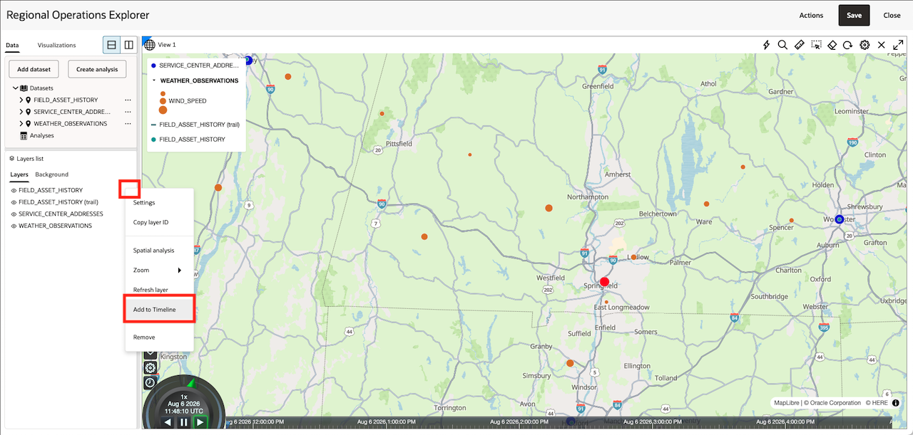

5. Open the same layer menu and select **Configure Animation**.

  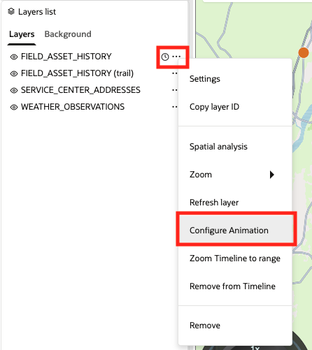

6. Switch **Animate layer based on automatic dataset refresh** on. Set **Time between auto refreshes** to `1` second.

7. Set **How much data to load** to `20` and select **minutes** as its time unit. Apply the settings.

    The data points are ten minutes apart. The one-second refresh makes the short workshop dataset respond promptly to Cesium timeline events.

  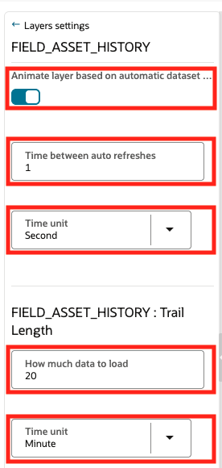

8. Select **Zoom Timeline to Range** for the primary layer. This sets the timeline to the earliest and latest `OBSERVED_AT` values.

  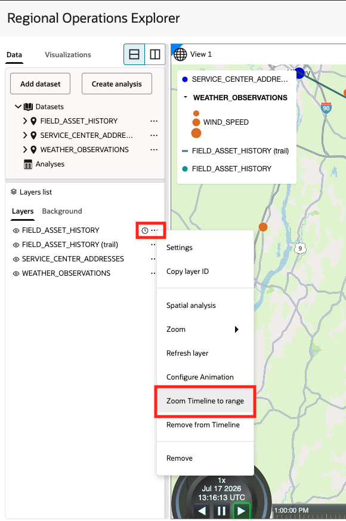

9. Open the timeline settings and set a minute-scale multiplier. Use `Minute (120x)`.

  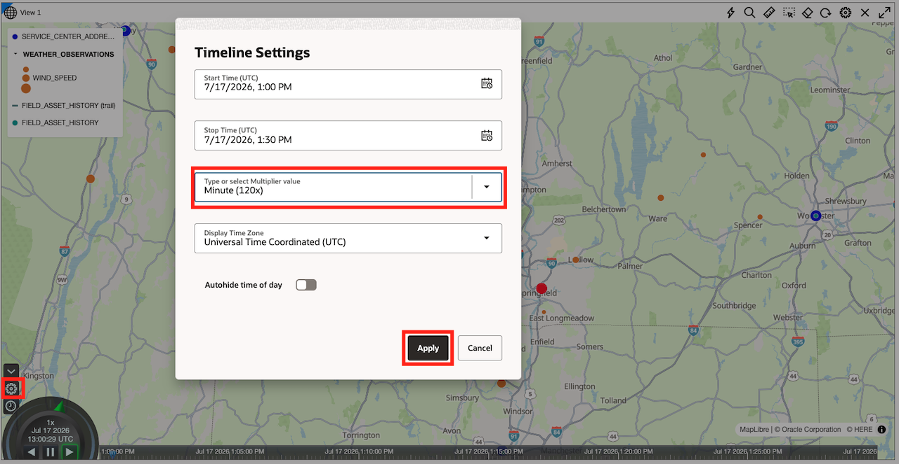

10. Use the timeline controls to play forward, pause, and move to a different time.

11. Confirm that asset locations change across the historical range and that Spatial Studio automatically adds a secondary trail layer for each moving object.

  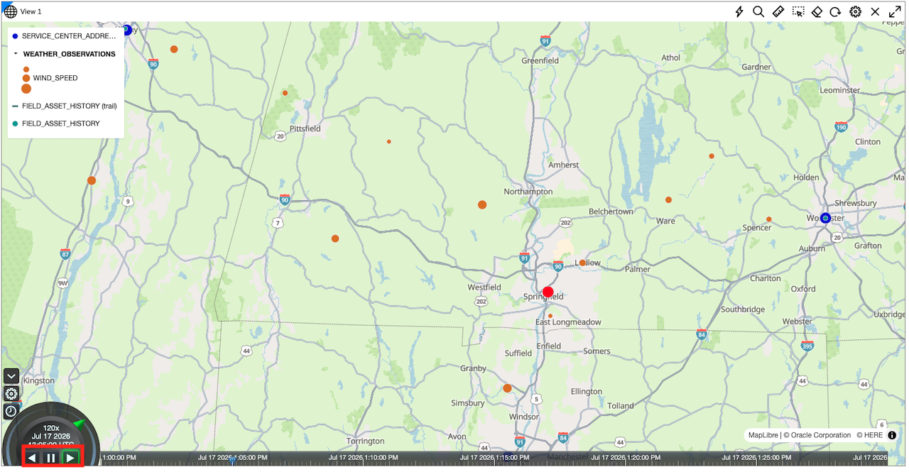

You may now **proceed to the next lab**.

## Learn More

- [Enable Spatiotemporal for a Dataset](https://docs.oracle.com/en/cloud/paas/autonomous-database/serverless/adstu/enable-spatiotemporal-dataset.html)
- [Visualize Spatiotemporal Datasets](https://docs.oracle.com/en/cloud/paas/autonomous-database/serverless/adstu/visualize-spatiotemporal-datasets.html)

## Acknowledgements

- **Authors** - Denise Myrick, Oracle Database Product Management
- **Last Updated By/Date** - Denise Myrick, August 2026
